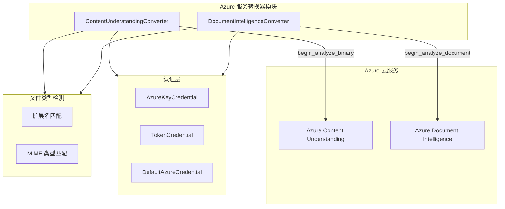
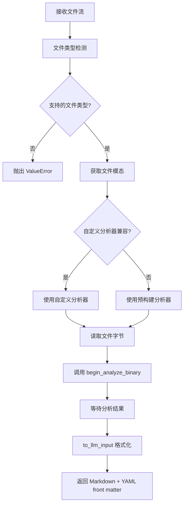
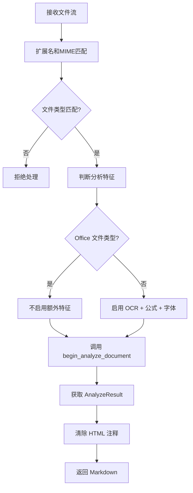
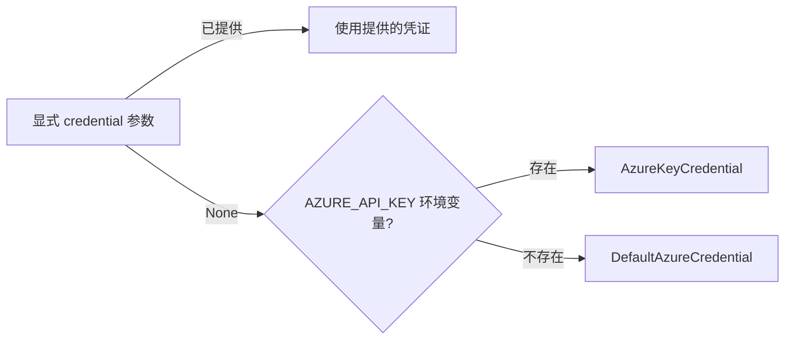

# Azure 服务转换器模块

## 模块简介

Azure 服务转换器模块（Azure Service Converters）是 markitdown-CN 中负责集成 Azure 云端 AI 服务进行高质量文档转换的核心模块。该模块包含两个主要转换器，分别对接 **Azure Content Understanding**（内容理解）和 **Azure Document Intelligence**（文档智能）两项 Azure 认知服务，将各类文件转换为结构化 Markdown 输出。

### 核心价值

- **多模态支持**：涵盖文档、图片、音频、视频四大类文件格式
- **智能路由**：根据文件模态自动选择最佳分析器
- **灵活认证**：支持 API Key、Token、DefaultAzureCredential 多种认证方式
- **可选依赖**：通过 pip extras 按需安装，不使用时不增加包体积

---

## 架构总览



---

## 组件详解

### 1. ContentUnderstandingConverter

**源文件**：`_cu_converter.py`

ContentUnderstandingConverter 是基于 Azure Content Understanding 服务的通用转换器，支持文档、图片、音频和视频四大类文件的高质量转换，并通过 YAML front matter 输出结构化字段。

#### 初始化参数

| 参数 | 类型 | 说明 |
|------|------|------|
| `endpoint` | `str` | Azure CU 资源端点 URL |
| `credential` | `AzureKeyCredential \| TokenCredential \| None` | 显式凭证。为 None 时回退到 `AZURE_API_KEY` 环境变量，再回退到 `DefaultAzureCredential` |
| `analyzer_id` | `Optional[str]` | 自定义分析器 ID。设置后，转换器在初始化时解析分析器的基础模态，仅将兼容文件路由到该分析器 |
| `file_types` | `Optional[List[ContentUnderstandingFileType]]` | 需要处理的文件类型列表，为 None 时使用全部支持格式 |

#### 核心转换流程



#### 智能分析器路由

当用户指定 `analyzer_id` 时，转换器实现智能路由机制：

1. **初始化阶段**：通过 `_resolve_analyzer_modality()` 解析分析器的基础模态（document / image / audio / video）
2. **转换阶段**：通过 `_is_analyzer_compatible()` 判断文件模态与分析器模态是否兼容
3. **回退策略**：不兼容时自动使用对应模态的预构建分析器

兼容性规则：
- **document 分析器**可处理 `document` 和 `image` 模态
- **其他模态分析器**仅处理相同模态文件

#### 支持的模态与文件类型

| 模态 | 文件格式 |
|------|----------|
| document | PDF, DOCX, PPTX, XLSX, HTML, TXT, MD, RTF, XML, EML, MSG |
| image | JPEG, PNG, BMP, TIFF, HEIF |
| video | MP4, M4V, MOV, AVI, MKV, WEBM, FLV, WMV |
| audio | WAV, MP3, M4A, FLAC, OGG, AAC, WMA |

---

### 2. DocumentIntelligenceConverter

**源文件**：`_doc_intel_converter.py`

DocumentIntelligenceConverter 是基于 Azure Document Intelligence 服务的专业文档转换器，专注于文档布局分析和文本提取，使用 `prebuilt-layout` 模型。

#### 初始化参数

| 参数 | 类型 | 默认值 | 说明 |
|------|------|--------|------|
| `endpoint` | `str` | - | Azure Document Intelligence 服务端点 |
| `api_version` | `str` | `"2024-07-31-preview"` | API 版本 |
| `credential` | `AzureKeyCredential \| TokenCredential \| None` | `None` | 认证凭证，回退逻辑同 CU 转换器 |
| `file_types` | `List[DocumentIntelligenceFileType]` | 全部支持格式 | 接受的文件类型列表 |

#### 转换流程



#### 分析特征策略

DocumentIntelligenceConverter 根据文件类型智能选择分析特征：

- **Office 文件**（DOCX, PPTX, XLSX, HTML）：不启用额外 OCR 特征，因为这些格式本身包含结构化数据
- **非 Office 文件**（PDF, JPEG, PNG, BMP, TIFF）：启用以下特征：
  - `FORMULAS`：公式提取
  - `OCR_HIGH_RESOLUTION`：高分辨率 OCR
  - `STYLE_FONT`：字体样式提取

#### 支持的文件类型

| 类别 | 格式 |
|------|------|
| 非 OCR 类型 | DOCX, PPTX, XLSX, HTML |
| OCR 类型 | PDF, JPEG, PNG, BMP, TIFF |

---

## 认证机制

两个转换器共享相同的认证回退链：



### 凭证类型说明

| 凭证类型 | 来源 | 适用场景 |
|----------|------|----------|
| `AzureKeyCredential` | `azure.core.credentials` | API Key 认证，适合开发测试 |
| `TokenCredential` | `azure.core.credentials` | Token 认证，适合生产环境 |
| `DefaultAzureCredential` | `azure.identity` | 自动发现凭证，支持多种 Azure 认证方式 |

---

## 文件类型检测子系统

### ContentUnderstandingConverter 的检测逻辑

文件类型检测通过两级回退实现：

1. **扩展名匹配**：使用 `_EXTENSION_MAP` 字典将文件扩展名映射到 `ContentUnderstandingFileType`
2. **MIME 类型匹配**：使用 `_detect_file_type_from_mime()` 通过 MIME 前缀匹配

辅助函数：

| 函数 | 职责 |
|------|------|
| `_detect_file_type()` | 入口函数，组合扩展名和 MIME 检测 |
| `_detect_file_type_from_mime()` | MIME 前缀遍历匹配 |
| `_clean_mime_type()` | 清除 MIME 类型中的参数和空白 |
| `_canonical_mime_type()` | 标准化 MIME 类型（含别名解析） |
| `_content_type_for()` | 解析发送给 CU API 的 Content-Type |
| `_get_modality()` | 获取文件类型对应的模态分类 |
| `_resolve_analyzer_modality()` | 解析分析器的基础模态 |
| `_is_analyzer_compatible()` | 判断分析器与文件模态的兼容性 |

### DocumentIntelligenceConverter 的检测逻辑

使用更简洁的检测方式：

| 函数 | 职责 |
|------|------|
| `_get_file_extensions()` | 根据文件类型列表返回扩展名列表 |
| `_get_mime_type_prefixes()` | 根据文件类型列表返回 MIME 前缀列表 |

---

## 输出格式对比

| 特性 | ContentUnderstandingConverter | DocumentIntelligenceConverter |
|------|-------------------------------|-------------------------------|
| 输出格式 | Markdown + YAML front matter | 纯 Markdown |
| 格式化函数 | `to_llm_input()` | 正则清除 HTML 注释 |
| 结构化字段 | 支持（通过 YAML front matter） | 不支持 |
| 模型 | 按模态选择预构建/自定义分析器 | `prebuilt-layout` 固定模型 |

---

## 依赖管理

两个转换器均采用可选依赖模式，在初始化时检查依赖是否已安装：

| 转换器 | pip extras 名称 | 安装命令 |
|--------|-----------------|----------|
| ContentUnderstandingConverter | `az-content-understanding` | `pip install markitdown[az-content-understanding]` |
| DocumentIntelligenceConverter | `az-doc-intel` | `pip install markitdown[az-doc-intel]` |

当依赖缺失时，转换器抛出 `MissingDependencyException`，提示用户安装对应的可选依赖包。

---

## 与其他模块的关系

- 两个转换器均继承自 [DocumentConverter](Core_Converters.md) 基类
- 转换结果封装为 [DocumentConverterResult](Core_Converters.md) 对象
- 文件流信息通过 [StreamInfo](Core_Converters.md) 传递
- 可选依赖缺失时抛出 [MissingDependencyException](Core_Converters.md)
- 模块通过 [MarkItDown 主入口](MarkItDown_Core.md) 注册和管理

---

## 使用示例

### Content Understanding 转换器

```python
from markitdown.converters._cu_converter import ContentUnderstandingConverter

converter = ContentUnderstandingConverter(
    endpoint="https://my-cu-resource.cognitiveservices.azure.com/",
    analyzer_id="my-custom-analyzer",  # 可选
)

result = converter.convert(file_stream, stream_info)
print(result.markdown)  # Markdown + YAML front matter
```

### Document Intelligence 转换器

```python
from markitdown.converters._doc_intel_converter import DocumentIntelligenceConverter

converter = DocumentIntelligenceConverter(
    endpoint="https://my-doc-intel.cognitiveservices.azure.com/",
    api_version="2024-07-31-preview",
)

result = converter.convert(file_stream, stream_info)
print(result.markdown)  # 纯 Markdown
```