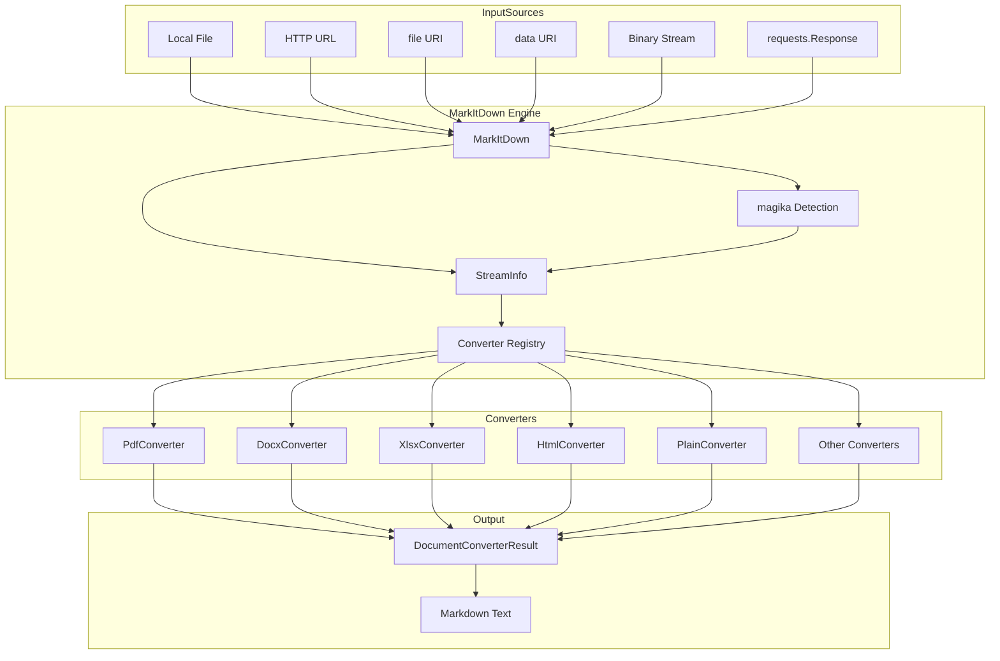
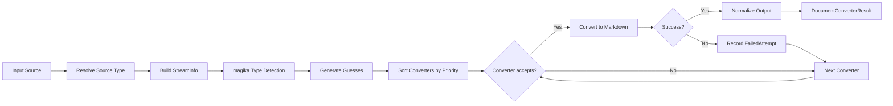

# Core_Engine -- 核心引擎模块

## 模块简介

Core_Engine 是 markitdown-CN 项目的核心引擎，负责将各类文档格式统一转换为 Markdown 文本。该模块提供了完整的转换管线，包括输入源识别、文件类型检测、转换器调度、插件扩展以及命令行接口。

**核心能力：**

- 支持本地文件、URL、file:// URI、data: URI、二进制流、HTTP 响应等多种输入源
- 内置 20+ 种格式转换器（PDF、DOCX、XLSX、PPTX、HTML、图片、音频等）
- 基于 magika 的智能文件类型检测
- 可插拔的转换器注册机制，支持优先级排序
- 第三方插件系统（基于 Python entry_points）
- 完整的异常体系与错误恢复机制
- 命令行工具支持 stdin / 文件 / URL 输入与文件输出

---

## 架构概览



---

## 转换流程



---

## 核心组件详解

### 1. MarkItDown 类

**文件：** `_markitdown.py`

`MarkItDown` 是整个引擎的入口和调度中心。它管理转换器的注册、输入源的解析以及转换流程的执行。

#### 初始化参数

| 参数 | 类型 | 默认值 | 说明 |
|------|------|--------|------|
| `enable_builtins` | `bool \| None` | `None`（等同 `True`） | 是否注册内置转换器 |
| `enable_plugins` | `bool \| None` | `None`（等同 `False`） | 是否加载第三方插件 |
| `llm_client` | `Any` | `None` | LLM 客户端（用于图像描述等） |
| `llm_model` | `str \| None` | `None` | LLM 模型名称 |
| `exiftool_path` | `str \| None` | `None` | exiftool 路径（自动检测） |
| `docintel_endpoint` | `str` | `None` | Azure Document Intelligence 端点 |
| `cu_endpoint` | `str` | `None` | Azure Content Understanding 端点 |

#### 核心方法

- **`convert(source, *, stream_info, **kwargs)`** -- 统一入口，自动根据 source 类型路由到 `convert_uri`、`convert_local`、`convert_stream` 或 `convert_response`。
- **`convert_local(path, ...)`** -- 转换本地文件。从路径推断扩展名和文件名，构建 StreamInfo。
- **`convert_uri(uri, ...)`** -- 转换 URI 资源，支持 `file://`、`data:`、`http://`、`https://` 四种协议。
- **`convert_stream(stream, ...)`** -- 转换二进制流，自动将不可 seek 的流加载到内存。
- **`convert_response(response, ...)`** -- 转换 `requests.Response` 对象，从 HTTP 头提取 Content-Type、Content-Disposition 等信息。
- **`register_converter(converter, *, priority)`** -- 注册转换器并设置优先级。
- **`enable_builtins(**kwargs)`** -- 注册所有内置转换器。
- **`enable_plugins(**kwargs)`** -- 加载并注册插件转换器。

#### 转换器优先级机制

转换器按优先级数值升序排列（数值越小优先级越高）：

| 优先级 | 常量 | 适用场景 |
|--------|------|----------|
| 0 | `PRIORITY_SPECIFIC_FILE_FORMAT` | 特定格式转换器（PDF、DOCX 等） |
| 10 | `PRIORITY_GENERIC_FILE_FORMAT` | 通用格式转换器（PlainText、HTML、Zip） |

后注册的转换器在同优先级下排在前面（插入列表头部），排序使用稳定排序。

---

### 2. ConverterRegistration 类

**文件：** `_markitdown.py`

转换器注册记录，将 `DocumentConverter` 实例与其优先级绑定在一起。

| 字段 | 类型 | 说明 |
|------|------|------|
| `converter` | `DocumentConverter` | 转换器实例 |
| `priority` | `float` | 优先级数值 |

---

### 3. DocumentConverter 抽象基类

**文件：** `_base_converter.py`

所有转换器的抽象超类，定义了两个核心方法：

#### `accepts(file_stream, stream_info, **kwargs) -> bool`

快速判断当前转换器是否能处理该文档。判断依据通常为：
- `stream_info.mimetype` -- MIME 类型匹配
- `stream_info.extension` -- 文件扩展名匹配
- `stream_info.url` -- 特殊 URL 模式（如 Wikipedia、YouTube）
- `stream_info.filename` -- 特定文件名（如 `Dockerfile`）

**重要约束：** 如果 `accepts()` 中读取了 `file_stream`，必须在返回前恢复流位置。

#### `convert(file_stream, stream_info, **kwargs) -> DocumentConverterResult`

执行实际的文档转换，返回包含 Markdown 文本的结果对象。

---

### 4. DocumentConverterResult 类

**文件：** `_base_converter.py`

转换结果的容器类。

| 属性 | 类型 | 说明 |
|------|------|------|
| `markdown` | `str` | 转换后的 Markdown 文本 |
| `title` | `str \| None` | 文档标题（可选） |
| `text_content` | `str` | `markdown` 的软弃用别名，新代码应使用 `markdown` |

支持 `__str__()` 方法直接输出 Markdown 文本。

---

### 5. StreamInfo 类

**文件：** `_stream_info.py`

流元数据容器，所有字段均可为 `None`，取决于输入源类型。

| 字段 | 类型 | 说明 |
|------|------|------|
| `mimetype` | `str \| None` | MIME 类型 |
| `extension` | `str \| None` | 文件扩展名（含点号） |
| `charset` | `str \| None` | 字符编码 |
| `filename` | `str \| None` | 文件名 |
| `local_path` | `str \| None` | 本地文件路径 |
| `url` | `str \| None` | 来源 URL |

#### `copy_and_update(*args, **kwargs) -> StreamInfo`

不可变更新方法：复制当前实例，并用传入的 `StreamInfo` 或关键字参数覆盖非 `None` 字段。这一设计保证了 StreamInfo 在转换管线中的安全传递与增量增强。

---

### 6. 异常体系

**文件：** `_exceptions.py`


#### MarkItDownException

所有 markitdown 异常的基类，继承自 `Exception`。

#### MissingDependencyException

当转换器依赖的可选库未安装时抛出。引擎会自动跳过该转换器，仅在无其他可用转换器时才向上传播错误。

#### UnsupportedFormatException

当没有任何转换器能处理给定文件时抛出，表示文件格式完全不受支持。

#### FileConversionException

当转换器匹配成功但转换过程中发生错误时抛出。包含 `attempts` 字段，记录所有失败的转换尝试。

#### FailedConversionAttempt

记录单次失败的转换尝试：

| 字段 | 类型 | 说明 |
|------|------|------|
| `converter` | `Any` | 失败的转换器实例 |
| `exc_info` | `tuple \| None` | `sys.exc_info()` 返回的异常信息元组 |

---

### 7. URI 工具函数

**文件：** `_uri_utils.py`

#### `file_uri_to_path(file_uri) -> Tuple[str | None, str]`

将 `file://` URI 转换为本地文件路径。返回 `(netloc, path)` 元组。仅允许 `localhost` 或空的 netloc。

#### `parse_data_uri(uri) -> Tuple[str | None, Dict[str, str], bytes]`

解析 `data:` URI，返回 `(mime_type, attributes, content)` 三元组。支持 base64 编码和普通 URL 编码的数据。

---

### 8. 插件加载器

**文件：** `_markitdown.py`

#### `_load_plugins() -> List[Any]`

基于 `importlib.metadata.entry_points` 的懒加载插件机制：

1. 查找 `markitdown.plugin` 组下的所有 entry points
2. 逐个加载插件类，加载失败时发出警告但不中断
3. 使用全局变量缓存已加载的插件，避免重复加载

插件通过调用 `plugin.register_converters(markitdown_instance, **kwargs)` 来注册自己的转换器。

---

### 9. 命令行接口

**文件：** `__main__.py`

#### `main()`

基于 `argparse` 的 CLI 入口，支持以下使用方式：

```bash
# 转换本地文件
markitdown example.pdf

# 从 stdin 读取
cat example.pdf | markitdown

# 输出到文件
markitdown example.pdf -o output.md

# 使用 Document Intelligence
markitdown example.pdf -d -e https://your-endpoint

# 使用 Content Understanding
markitdown example.pdf --use-cu --cu-endpoint https://your-endpoint

# 启用第三方插件
markitdown example.pdf -p

# 列出已安装插件
markitdown --list-plugins
```

**CLI 参数一览：**

| 参数 | 说明 |
|------|------|
| `filename` | 输入文件路径（可选，缺省读取 stdin） |
| `-o / --output` | 输出文件路径（缺省输出到 stdout） |
| `-x / --extension` | 文件扩展名提示 |
| `-m / --mime-type` | MIME 类型提示 |
| `-c / --charset` | 字符编码提示 |
| `-d / --use-docintel` | 使用 Azure Document Intelligence |
| `--use-cu` | 使用 Azure Content Understanding |
| `-e / --endpoint` | Document Intelligence 端点 |
| `--cu-endpoint` | Content Understanding 端点 |
| `-p / --use-plugins` | 启用第三方插件 |
| `--list-plugins` | 列出已安装插件 |
| `--keep-data-uris` | 保留完整 data URI（默认截断） |

#### `_handle_output(args, result)`

将转换结果输出到文件或 stdout。输出到 stdout 时使用 `errors="replace"` 处理编码问题。

#### `_exit_with_error(message)`

打印错误信息并以退出码 1 退出程序。

---

## 内部转换流程详解

`_convert()` 方法是转换管线的核心，其执行逻辑如下：

1. **排序转换器** -- 按优先级升序排列所有已注册的转换器
2. **遍历 StreamInfo 猜测** -- 对每个猜测（加上一个空 StreamInfo 兜底），尝试所有转换器
3. **accepts 检查** -- 调用 `converter.accepts()` 判断是否匹配
4. **执行转换** -- 调用 `converter.convert()` 执行转换，失败时记录 `FailedConversionAttempt`
5. **流位置恢复** -- 每次转换后通过 `file_stream.seek(cur_pos)` 恢复流位置
6. **输出规范化** -- 去除行尾空白、合并连续空行
7. **错误汇总** -- 若所有尝试失败，抛出 `FileConversionException`（含所有失败记录）或 `UnsupportedFormatException`

### 文件类型检测 (`_get_stream_info_guesses`)

该方法整合多种信息源生成 StreamInfo 猜测列表：

1. **扩展名推断** -- 通过 `mimetypes.guess_type` 从扩展名推断 MIME 类型
2. **MIME 推断** -- 通过 `mimetypes.guess_all_extensions` 从 MIME 类型推断扩展名
3. **magika 检测** -- 使用 Google magika 模型对流内容进行深度检测，获取 MIME 类型、扩展名、字符集等
4. **兼容性判断** -- 若 magika 结果与已有信息兼容则合并，否则作为独立猜测加入列表
5. **字符集检测** -- 对文本类型文件，使用 `charset_normalizer` 从流的前 4KB 推断编码

---

## 内置转换器注册顺序

`enable_builtins()` 方法按以下顺序注册转换器（后注册的同优先级转换器排在前面）：

| 顺序 | 转换器 | 优先级 |
|------|--------|--------|
| 1 | PlainTextConverter | GENERIC (10) |
| 2 | ZipConverter | GENERIC (10) |
| 3 | HtmlConverter | GENERIC (10) |
| 4 | RssConverter | SPECIFIC (0) |
| 5 | WikipediaConverter | SPECIFIC (0) |
| 6 | YouTubeConverter | SPECIFIC (0) |
| 7 | BingSerpConverter | SPECIFIC (0) |
| 8 | DocxConverter | SPECIFIC (0) |
| 9 | XlsxConverter | SPECIFIC (0) |
| 10 | XlsConverter | SPECIFIC (0) |
| 11 | PptxConverter | SPECIFIC (0) |
| 12 | AudioConverter | SPECIFIC (0) |
| 13 | ImageConverter | SPECIFIC (0) |
| 14 | IpynbConverter | SPECIFIC (0) |
| 15 | PdfConverter | SPECIFIC (0) |
| 16 | OutlookMsgConverter | SPECIFIC (0) |
| 17 | EpubConverter | SPECIFIC (0) |
| 18 | CsvConverter | SPECIFIC (0) |

可选的云服务转换器（如 DocumentIntelligenceConverter、ContentUnderstandingConverter）在提供端点后注册在栈顶，优先级最高。

---

## 模块间关系

Core_Engine 与项目其他模块的关系如下：

- **[Converters](Converters.md)** -- 提供各类具体格式的转换器实现（PDF、DOCX、HTML 等），通过 `register_converter` 注册到引擎
- **[Plugin_System](Plugin_System.md)** -- 第三方插件通过 entry_points 机制加载，调用 `register_converters` 向引擎注入自定义转换器
- **[CLI](CLI.md)** -- 命令行接口模块，通过实例化 `MarkItDown` 类完成文件转换
- **[Utilities](Utilities.md)** -- 提供 URI 解析等底层工具函数

---

## 使用示例

### 基本用法

```python
from markitdown import MarkItDown

md = MarkItDown()
result = md.convert("report.pdf")
print(result.markdown)
```

### 指定流信息

```python
from markitdown import MarkItDown, StreamInfo

md = MarkItDown()
info = StreamInfo(extension=".csv", mimetype="text/csv")
result = md.convert_stream(stream, stream_info=info)
```

### 启用插件与云服务

```python
md = MarkItDown(
    enable_plugins=True,
    docintel_endpoint="https://your-docintel-endpoint.cognitiveservices.azure.com/",
)
result = md.convert("scan.pdf")
```

### 自定义转换器

```python
from markitdown import MarkItDown, DocumentConverter, DocumentConverterResult, StreamInfo

class MyConverter(DocumentConverter):
    def accepts(self, file_stream, stream_info, **kwargs):
        return stream_info.extension == ".myext"

    def convert(self, file_stream, stream_info, **kwargs):
        content = file_stream.read().decode("utf-8")
        return DocumentConverterResult(markdown=content, title="Custom")

md = MarkItDown()
md.register_converter(MyConverter(), priority=0)
```
