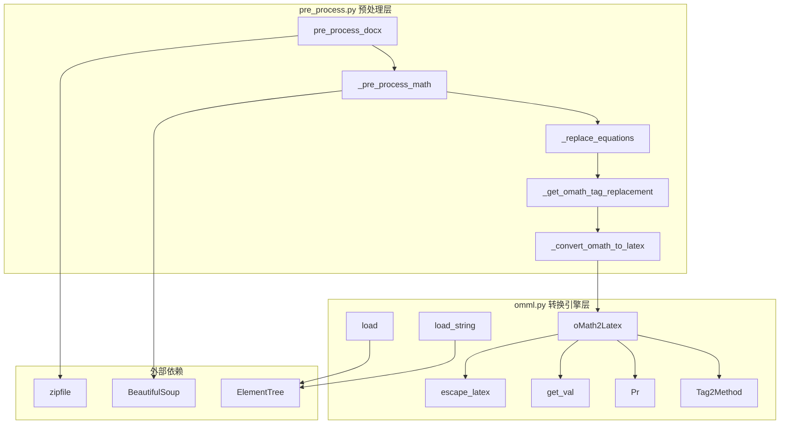
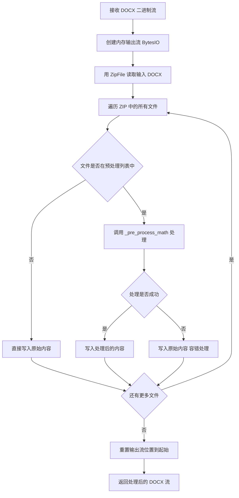
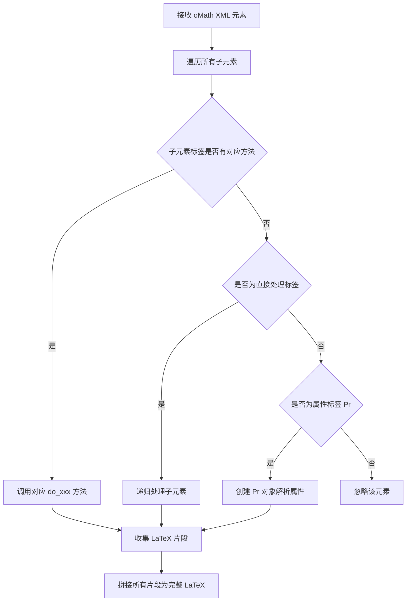
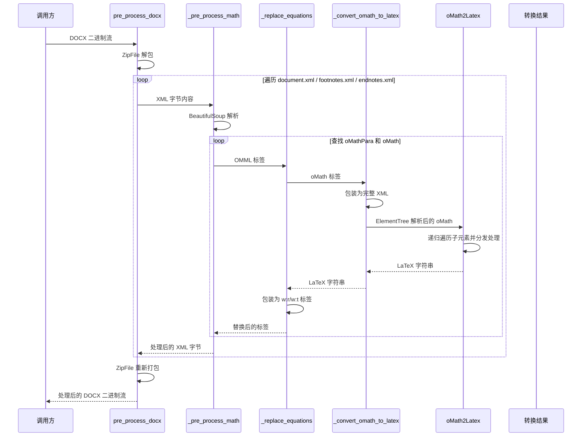
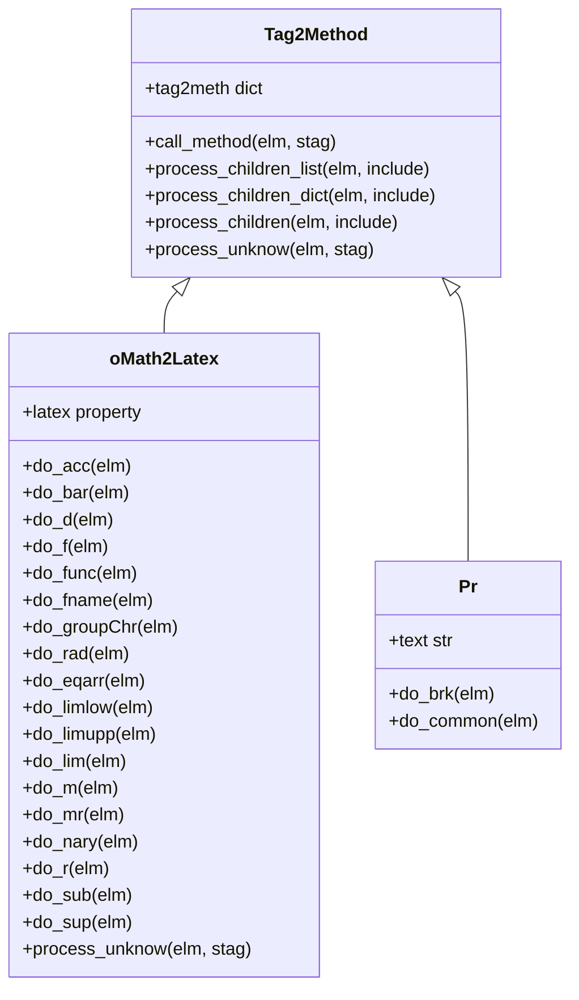

# DOCX Math Utils 模块

## 简介

DOCX Math Utils 模块是 markitdown-CN 项目中负责将 DOCX 文件中的 Office Math Markup Language (OMML) 数学公式转换为 LaTeX 格式的核心工具模块。该模块由两个子模块组成：`omml.py` 提供 OMML XML 到 LaTeX 的底层转换引擎，`pre_process.py` 提供 DOCX 文件的预处理流程编排。

DOCX 文件本质上是 ZIP 压缩包，其中包含多个 XML 文件。数学公式以 OMML 格式嵌入在 `document.xml`、`footnotes.xml` 和 `endnotes.xml` 中。本模块在 DOCX 转 Markdown 的主流程之前介入，通过预处理将这些 OMML 公式就地替换为 LaTeX 表达式，使得后续的 [Media_Converters](Media_Converters.md) 等模块可以在统一的文本格式下处理文档内容。

---

## 模块架构

### 组件总览



### 层次划分

| 层次 | 文件 | 职责 |
|------|------|------|
| 预处理层 | `pre_process.py` | DOCX 文件解包、XML 内容处理、公式替换、重新打包 |
| 转换引擎层 | `omml.py` | OMML XML 元素解析、LaTeX 生成、字符转义 |

---

## 预处理层详解 (pre_process.py)

### pre_process_docx — 顶层入口

`pre_process_docx` 是整个数学公式预处理流程的入口函数。它接收一个 DOCX 二进制流，在内存中完成解包、处理、重新打包的全过程，不写入磁盘。

#### 处理流程



#### 需处理的文件列表

| 文件路径 | 说明 |
|----------|------|
| `word/document.xml` | 文档主体内容 |
| `word/footnotes.xml` | 脚注内容 |
| `word/endnotes.xml` | 尾注内容 |

> **容错设计**：若某个 XML 文件的预处理过程中抛出异常，函数会静默回退并写入原始内容，确保整个 DOCX 文件不会因单个公式转换失败而损坏。

---

### _pre_process_math — XML 内容处理

`_pre_process_math` 接收 XML 内容的字节流，使用 BeautifulSoup 解析后，按顺序查找并替换所有 OMML 数学元素。

#### 处理顺序


> **重要**：先处理 `oMathPara`（块级公式）再处理 `oMath`（行内公式），因为 `oMathPara` 内部包含 `oMath` 子元素，先处理外层可避免重复处理。

---

### _replace_equations — 公式替换

`_replace_equations` 根据标签类型执行不同的替换策略：

| 标签类型 | 处理方式 | LaTeX 格式 |
|----------|----------|------------|
| `oMathPara` | 创建新 `w:p` 段落，内部每个 `oMath` 转为块级公式 | `$$LaTeX$$` |
| `oMath` | 直接替换为行内公式 | `$LaTeX$` |
| 其他 | 抛出 `ValueError` | — |

---

### _get_omath_tag_replacement — 生成替换标签

该函数将 OMML 元素转换为 LaTeX 字符串，并包装为 BeautifulSoup 的 `w:r` / `w:t` 标签结构，以符合 DOCX XML 的格式规范。

- `block=True`：生成的 LaTeX 用 `$$...$$` 包裹（块级公式）
- `block=False`：生成的 LaTeX 用 `$...$` 包裹（行内公式）

---

### _convert_omath_to_latex — OMML 到 LaTeX 的桥梁

该函数是预处理层与 OMML 转换引擎之间的桥梁：

1. 将 BeautifulSoup Tag 格式化为完整的 XML 文档字符串（使用 `MATH_ROOT_TEMPLATE` 模板）
2. 用 ElementTree 解析该 XML
3. 查找 `oMath` 元素
4. 调用 `oMath2Latex` 进行转换
5. 返回 LaTeX 字符串

---

## OMML 转换引擎详解 (omml.py)

### oMath2Latex — 核心转换类

`oMath2Latex` 是 OMML 到 LaTeX 的核心转换类，继承自 `Tag2Method`，采用“标签名到方法名”的映射模式，将每种 OMML 数学结构分发到对应的处理方法。

#### 支持的数学结构

| OMML 标签 | 方法 | LaTeX 输出 | 说明 |
|-----------|------|-----------|------|
| `acc` | `do_acc` | 重音符号 | 如 hat、tilde 等 |
| `bar` | `do_bar` | 上划线/下划线 | 共轭、均值等 |
| `d` | `do_d` | 分隔符 | 括号、绝对值等 |
| `f` | `do_f` | 分数 | 普通分数、斜分数等 |
| `func` | `do_func` | 函数应用 | sin、cos 等 |
| `fName` | `do_fname` | 函数名称 | 函数名解析 |
| `groupChr` | `do_groupChr` | 组合字符 | 下括号、上括号等 |
| `rad` | `do_rad` | 根式 | 平方根、n次方根 |
| `eqArr` | `do_eqarr` | 公式数组 | 多行对齐公式 |
| `limLow` | `do_limlow` | 下限 | lim、sum 等的下标 |
| `limUpp` | `do_limupp` | 上限 | 上限标注 |
| `lim` | `do_lim` | 极限值 | 极限表达式的值部分 |
| `m` | `do_m` | 矩阵 | 矩阵环境 |
| `mr` | `do_mr` | 矩阵行 | 单行矩阵元素 |
| `nary` | `do_nary` | N元运算符 | 求和、积分、乘积等 |
| `r` | `do_r` | 文本运行 | 普通文本和符号 |
| `sub` | `do_sub` | 下标 | 下标表达 |
| `sup` | `do_sup` | 上标 | 上标表达 |

#### 转换流程



---

### Tag2Method — 标签分发基类

`Tag2Method` 提供了 XML 标签到处理方法的通用分发机制，是 `oMath2Latex` 和 `Pr` 的共同基类。

#### 核心方法

| 方法 | 功能 |
|------|------|
| `call_method` | 根据标签名查找并调用对应方法 |
| `process_children_list` | 遍历子元素，返回 `(标签名, 结果, 元素)` 元组的迭代器 |
| `process_children_dict` | 遍历子元素，返回以标签名为键的字典 |
| `process_children` | 遍历子元素，返回拼接后的字符串 |
| `process_unknow` | 处理未知标签的钩子方法（子类可覆写） |

---

### Pr — 属性解析类

`Pr` 继承自 `Tag2Method`，负责解析 OMML 元素的属性信息（如分隔符类型、位置、起止字符等）。它支持以下属性标签：

- `chr` — 字符属性
- `pos` — 位置属性
- `begChr` / `endChr` — 起止字符
- `type` — 类型属性
- `brk` — 换行符

属性值存储在内部字典中，可通过属性访问方式获取。

---

### 工具函数

#### load / load_string

提供从文件流或字符串解析 OMML 的便捷入口：

- `load(stream)`：从文件流解析 XML，查找所有 `oMath` 元素并生成 LaTeX
- `load_string(string)`：从 XML 字符串解析，行为同上

两者均返回生成器，逐个产出 `oMath2Latex` 对象。

#### escape_latex

对 LaTeX 特殊字符进行转义处理：

- 遍历输入字符串中的每个字符
- 对属于 LaTeX 特殊字符集 (`CHARS`) 且未被反斜杠保护的字符添加转义
- 先处理双反斜杠 `\\` 以避免重复转义

#### get_val

通用的值查找函数：

- 从指定字典 (`store`) 中查找键对应的 LaTeX 映射值
- 若键为 `None`，返回默认值
- 若字典中未找到，返回键本身作为回退

---

## 完整数据流



---

## 类继承关系



---

## 依赖关系

### 内部依赖

- `pre_process.py` 依赖 `omml.py` 中的 `oMath2Latex` 和 `OMML_NS` 常量
- `_convert_omath_to_latex` 依赖 `MATH_ROOT_TEMPLATE` 模板和 `oMath2Latex` 类

### 外部依赖

| 依赖 | 类型 | 用途 |
|------|------|------|
| `BeautifulSoup` (bs4) | Python 库 | XML 解析与标签操作 |
| `xml.etree.ElementTree` | Python 标准库 | OMML XML 解析 |
| `zipfile` | Python 标准库 | DOCX ZIP 文件操作 |
| `io.BytesIO` | Python 标准库 | 内存中的二进制流 |

### 与其他模块的关系

- 本模块的 `pre_process_docx` 在 DOCX 转换器的主流程中被调用，位于文档解析之前的预处理阶段
- 预处理后的 DOCX 文件中的公式已转为 LaTeX 文本，后续转换器可按普通文本处理
- 与 [Media_Converters](Media_Converters.md) 模块无直接依赖，但同属 markitdown 的转换器体系

---

## 错误处理策略

| 场景 | 处理方式 |
|------|----------|
| XML 解析失败 | `pre_process_docx` 捕获异常，写入原始内容 |
| 不支持的 OMML 标签 | `_replace_equations` 抛出 `ValueError`，上层捕获后回退 |
| 不支持的函数名 | `do_fname` 抛出 `NotImplementedError` |
| 不支持的极限表达式 | `do_limlow` 抛出 `NotImplementedError` |
| 未知子标签 | `process_unknow` 返回 `None`，静默跳过 |

---

## 设计特点

### Tag2Method 分发模式

采用“标签名 -> 方法名”的映射模式，通过 `tag2meth` 字典实现自动分发。这种设计使得：

1. 新增数学结构支持只需添加新的 `do_xxx` 方法和字典条目
2. 各数学结构的转换逻辑相互独立，易于维护
3. 通过 `process_unknow` 钩子支持灵活的未知标签处理

### 内存中完成全流程

整个预处理过程（解包、处理、重新打包）均在内存中通过 `BytesIO` 完成，避免了磁盘 I/O，适合高并发场景。

### LaTeX 分隔符规范

- 行内公式：`$...$`（单个美元符号）
- 块级公式：`$$...$$`（双美元符号）

这与 Markdown 中的 LaTeX 数学公式规范一致，确保后续渲染器可以正确识别和渲染。

---

## 扩展指南

### 支持新的 OMML 结构

1. 在 `oMath2Latex` 类中添加 `do_xxx(self, elm)` 方法
2. 在 `tag2meth` 字典中注册标签名到方法的映射
3. 在方法内使用 `process_children_dict` 或 `process_children_list` 解析子元素
4. 使用预定义的 LaTeX 模板格式化输出

### 添加新的预处理步骤

`pre_process_docx` 已预留扩展点，在 `_pre_process_math` 之后可以添加更多预处理步骤：

```python
updated_content = _pre_process_math(content)
# 未来可在此处添加更多预处理步骤
# updated_content = _pre_process_other(updated_content)
```
