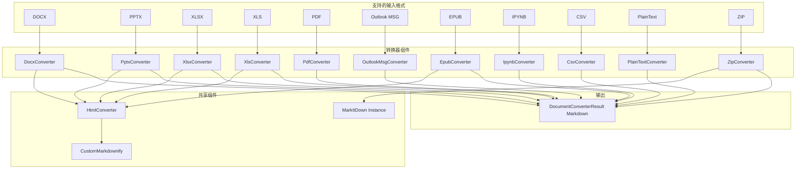
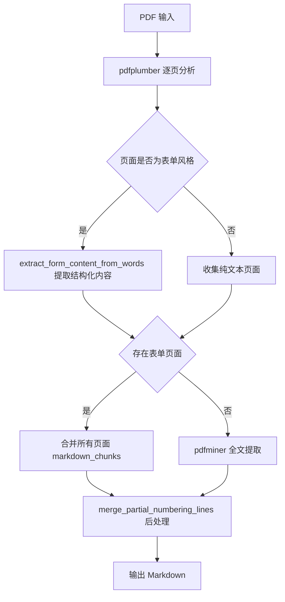
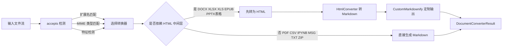

# Document Format Converters 模块

## 模块简介

`Document_Format_Converters` 是 markitdown-CN 项目的核心文档格式转换模块，负责将多种常见文档格式（DOCX、PPTX、XLSX/XLS、PDF、EPUB、Outlook MSG、Jupyter Notebook、CSV、纯文本、ZIP）统一转换为 Markdown 输出。该模块采用"一个格式一个转换器"的设计思路，每个转换器独立实现 `accepts()` 与 `convert()` 方法，遵循 [DocumentConverter](Core_Converter_Framework.md) 统一接口，便于按需注册和扩展。

## 核心功能

| 功能 | 说明 |
|------|------|
| 多格式文档转换 | 支持 10+ 种主流办公与数据文件格式到 Markdown 的转换 |
| HTML 中间层复用 | DOCX、XLSX、XLS、EPUB 等格式先转为 HTML，再通过 [HtmlConverter](Core_Converter_Framework.md) 统一转 Markdown |
| 表格智能提取 | PDF 转换器内置 pdfplumber 无框表格识别算法，CSV/XLSX 直接生成 Markdown 表格 |
| LLM 图像描述 | PPTX 转换器可调用外部 LLM 为幻灯片中的图片生成描述文本 |
| 递归 ZIP 解包 | ZIP 转换器通过 [MarkItDown](Core_Converter_Framework.md) 主实例递归处理包内文件 |
| 依赖延迟加载 | 各转换器在转换时才检查第三方依赖是否可用，缺失时抛出 `MissingDependencyException` |
| 自定义 Markdownify | 通过 `_CustomMarkdownify` 定制 HTML→Markdown 转换行为（标题样式、URI 转义、data URI 截断等） |

## 架构图



## 转换器职责详解

### DocxConverter

**源文件**: `_docx_converter.py`

将 `.docx` 文件转换为 Markdown。继承自 `HtmlConverter`，内部组合了一个 `HtmlConverter` 实例。

**转换流程**:
1. 通过 `pre_process_docx()` 对文件流做预处理
2. 调用 `mammoth.convert_to_html()` 将 DOCX 转为 HTML
3. 将 HTML 交给内部 `HtmlConverter.convert_string()` 完成最终 Markdown 输出

**支持选项**: 可通过 `style_map` 参数自定义 mammoth 的样式映射规则，实现精细的标题/段落样式控制。

**依赖**: `mammoth`

---

### PptxConverter

**源文件**: `_pptx_converter.py`

将 `.pptx` 演示文稿转换为 Markdown，逐幻灯片解析并提取内容。

**转换流程**:
1. 使用 `python-pptx` 解析 PPTX 文件
2. 按幻灯片编号迭代，对每张幻灯片中的 Shape 按位置排序
3. 根据 Shape 类型分别处理:
   - **图片**: 提取 alt text，可选调用 LLM 生成描述（`llm_caption()`），支持 base64 data URI 输出
   - **表格**: 转为 HTML 表格后通过 `HtmlConverter` 转 Markdown
   - **图表**: 提取类别与系列数据，生成 Markdown 表格
   - **文本框**: 标题 Shape 输出为 `# heading`，其余直接输出文本
   - **分组 Shape**: 递归处理子 Shape
4. 提取幻灯片备注，附加到对应幻灯片的 `### Notes:` 小节

**依赖**: `python-pptx`

---

### XlsxConverter / XlsConverter

**源文件**: `_xlsx_converter.py`

将 Excel 电子表格转换为 Markdown。两者实现几乎一致，区别在于使用的 pandas 引擎不同。

| 转换器 | 支持格式 | pandas 引擎 |
|--------|----------|-------------|
| `XlsxConverter` | `.xlsx`, `.xlsm` | `openpyxl` |
| `XlsConverter` | `.xls` | `xlrd` |

**转换流程**:
1. 使用 `pd.read_excel(sheet_name=None)` 读取所有工作表
2. 每个工作表输出为 `## 工作表名` 标题
3. 将 DataFrame 通过 `to_html()` 转为 HTML
4. 经 `HtmlConverter.convert_string()` 转为 Markdown 表格

**依赖**: `pandas`, `openpyxl`(XLSX) / `xlrd`(XLS)

---

### PdfConverter

**源文件**: `_pdf_converter.py`

将 PDF 文件转换为 Markdown，是本模块中最复杂的转换器，包含智能表单识别与无框表格提取算法。

**转换策略**:



**核心辅助函数**:

| 函数 | 职责 |
|------|------|
| `_extract_form_content_from_words` | 分析页面中文字的 Y 坐标分行、X 坐标分列，通过自适应容差算法识别全局列结构，将表单/表格区域输出为对齐的 Markdown 表格，非表格内容输出为纯文本 |
| `_extract_tables_from_words` | 专注于无边框表格提取，通过列位置聚类和行质量校验（至少 3 行、单元格内容简短）识别结构化表格数据 |
| `_to_markdown_table` | 将二维列表格式化为对齐的 Markdown 表格，支持是否包含分隔行 |
| `_merge_partial_numbering_lines` | 后处理阶段合并 MasterFormat 风格的部分编号行（如 `.1` 单独成行时与下一行合并） |
| `extract_cells` | 将一行中的文字按全局列边界分配到对应单元格 |

**依赖**: `pdfplumber`, `pdfminer.six`

---

### OutlookMsgConverter

**源文件**: `_outlook_msg_converter.py`

将 Outlook `.msg` 邮件文件转换为 Markdown。

**转换流程**:
1. 使用 `olefile` 解析 OLE 复合文档结构
2. 通过硬编码的 stream 路径提取邮件头:
   - `__substg1.0_0C1F001F` → From
   - `__substg1.0_0E04001F` → To
   - `__substg1.0_0037001F` → Subject
3. 提取邮件正文 `__substg1.0_1000001F`
4. 输出格式为 `# Email Message` + 元数据 + `## Content` + 正文

**编码处理**: `_get_stream_data()` 依次尝试 UTF-16-LE → UTF-8 → UTF-8(ignore) 解码。

**accepts 检测**: 除扩展名和 MIME 类型匹配外，还会进行 OLE 文件格式验证和 Outlook 特征 stream 检测。

**依赖**: `olefile`

---

### EpubConverter

**源文件**: `_epub_converter.py`

将 EPUB 电子书转换为 Markdown。继承自 `HtmlConverter`。

**转换流程**:
1. 将 EPUB 作为 ZIP 文件打开
2. 解析 `META-INF/container.xml` 定位 `content.opf`
3. 从 `content.opf` 提取 Dublin Core 元数据（title、authors、language、publisher、date、description、identifier）
4. 解析 manifest 和 spine，按阅读顺序排列内容文件
5. 逐个将 spine 中的 HTML/XHTML 文件通过 `HtmlConverter` 转为 Markdown
6. 将元数据以 `**key:** value` 格式插入文档头部

**依赖**: Python 标准库 `zipfile`, `xml.dom.minidom`

---

### IpynbConverter

**源文件**: `_ipynb_converter.py`

将 Jupyter Notebook (`.ipynb`) 文件转换为 Markdown。

**转换流程**:
1. 读取并解析 Notebook JSON
2. 遍历 `cells` 数组，按单元格类型处理:
   - `markdown` 单元格: 直接输出原始 Markdown
   - `code` 单元格: 包裹在 ````python` 代码块中
   - `raw` 单元格: 包裹在 ```` ` 代码块中
3. 标题提取: 优先从第一个 `# heading` 行获取，其次从 `metadata.title` 获取

**accepts 检测**: 对 `application/json` 等候选 MIME 类型，会进一步读取内容检查是否包含 `nbformat` 和 `nbformat_minor` 字段。

---

### CsvConverter

**源文件**: `_csv_converter.py`

将 CSV 文件转换为 Markdown 表格。

**转换流程**:
1. 使用 `charset` 或 `chardet`（通过 `from_bytes`）检测编码并读取内容
2. 用 `csv.reader` 解析
3. 第一行作为表头，生成 `| header |` 格式的 Markdown 表格
4. 自动对齐列数（不足补空、多余截断）

---

### PlainTextConverter

**源文件**: `_plain_text_converter.py`

处理 `text/plain` 类型内容，是最简单的转换器。

**转换流程**: 根据 `stream_info.charset` 解码文本，若无 charset 则使用 `chardet` 自动检测，直接作为 Markdown 输出。

**accepts 检测**: 如果 `stream_info.charset` 存在则直接接受（表示上游已确认为文本），否则检查扩展名和 MIME 类型。

---

### ZipConverter

**源文件**: `_zip_converter.py`

将 ZIP 压缩包转换为 Markdown，通过递归委托实现嵌套文件的转换。

**转换流程**:
1. 打开 ZIP 文件，遍历 `namelist()`
2. 将每个文件读取为 `BytesIO` 流
3. 调用 `self._markitdown.convert_stream()` 进行转换（递归利用已注册的所有转换器）
4. 每个文件输出为 `## File: 文件名` 小节
5. 静默跳过不支持的格式（`UnsupportedFormatException`）和转换失败（`FileConversionException`）

**设计要点**: 构造函数需要注入 `MarkItDown` 实例引用，这使得 ZIP 转换器可以复用主框架的转换器注册表和流检测逻辑。

---

### _CustomMarkdownify

**源文件**: `_markdownify.py`

继承 `markdownify.MarkdownConverter`，定制 HTML→Markdown 转换行为。被 [HtmlConverter](Core_Converter_Framework.md) 间接使用。

**定制内容**:

| 方法 | 定制行为 |
|------|----------|
| `__init__` | 默认标题样式设为 ATX（`#`/`##`），默认关闭 `keep_data_uris` |
| `convert_hn` | 确保标题前换行，避免与前一元素粘连 |
| `convert_a` | 移除 `javascript:` 等非 HTTP 协议的链接，对 URI path 进行 `quote/unquote` 转义处理 |
| `convert_img` | 截断 `data:` URI 图片源为 `data:image/png,...` 占位，去除 alt 文本中的换行 |
| `convert_input` | 将 HTML checkbox 转为 `[x]` / `[ ]` Markdown 语法 |

## 转换流程总览



## 设计模式与关键决策

### 依赖延迟检查

每个转换器的 `convert()` 方法在开头检查第三方依赖是否成功导入。若模块导入失败（记录在 `_dependency_exc_info` 中），则抛出 `MissingDependencyException` 并附带安装指引。这使得核心框架可以在不安装全部可选依赖的情况下启动。

### HTML 中间层模式

多个转换器（DOCX、XLSX、XLS、EPUB、PPTX 中的表格部分）采用"先转 HTML 再转 Markdown"的策略。这样做的好处:
- 复用 `HtmlConverter` 与 `_CustomMarkdownify` 的成熟转换逻辑
- 减少各转换器中的 Markdown 格式化重复代码
- 确保不同格式的输出风格一致

### 文件类型识别

`accepts()` 方法同时支持两种识别策略:
1. **扩展名匹配**: 快速路径，检查 `stream_info.extension` 是否在预定义的 `ACCEPTED_FILE_EXTENSIONS` 列表中
2. **MIME 类型前缀匹配**: 检查 `stream_info.mimetype` 是否以 `ACCEPTED_MIME_TYPE_PREFIXES` 中的任一前缀开头

部分转换器（OutlookMsgConverter、IpynbConverter）还会进行内容特征检测作为补充。

### PDF 智能提取

PDF 转换器采用双层提取策略:
- **pdfplumber 优先**: 逐页分析文字位置，对表单/表格风格的页面进行结构化提取
- **pdfminer 兜底**: 当没有表单页面或 pdfplumber 异常时，使用 pdfminer 进行全文提取（对散文类文档的文字间距更优）

表单检测的核心算法位于 `_extract_form_content_from_words()`，通过以下步骤工作:
1. 按 Y 坐标聚类文字为行
2. 分析每行的 X 坐标分布，识别列分组
3. 使用自适应容差算法（基于间距统计分析）确定全局列边界
4. 将表格行输出为对齐 Markdown 表格，段落行输出为纯文本

## 与其他模块的关系

- [Core_Converter_Framework](Core_Converter_Framework.md): 本模块所有转换器均实现 `DocumentConverter` 基类接口，并由 `MarkItDown` 主类统一管理注册与调度
- [Media_and_Special_Converters](Media_and_Special_Converters.md): PPTX 转换器的 LLM 图像描述功能依赖 `llm_caption()` 工具函数
- [Stream_Detection_and_Info](Stream_Detection_and_Info.md): 所有转换器的 `accepts()` 方法依赖 `StreamInfo` 对象提供的扩展名、MIME 类型和字符集信息

## 扩展新转换器

要添加新的文档格式支持，需遵循以下步骤:

1. 在 `converters/` 目录下创建 `_xxx_converter.py`
2. 实现继承自 `DocumentConverter` 的 `XxxConverter` 类
3. 实现 `accepts()` 方法，定义文件类型匹配规则
4. 实现 `convert()` 方法，返回 `DocumentConverterResult`
5. 如需 HTML 中间层，组合 `HtmlConverter` 实例
6. 在模块入口注册新转换器