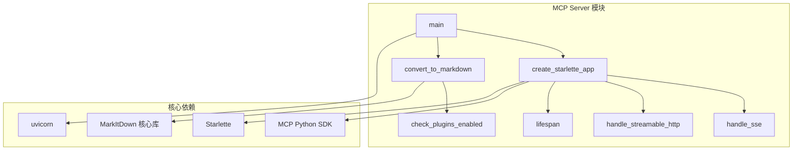
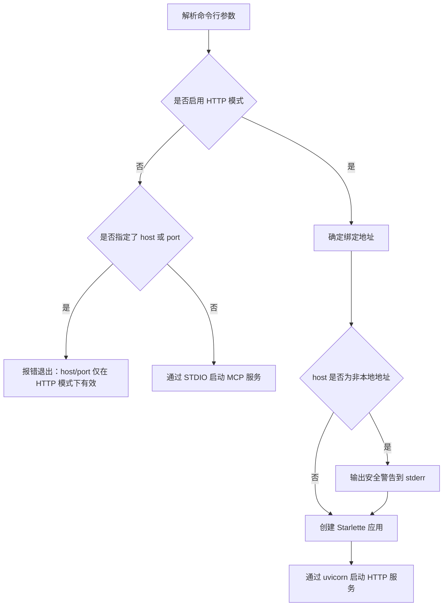
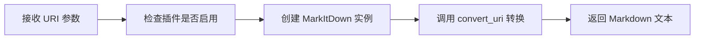
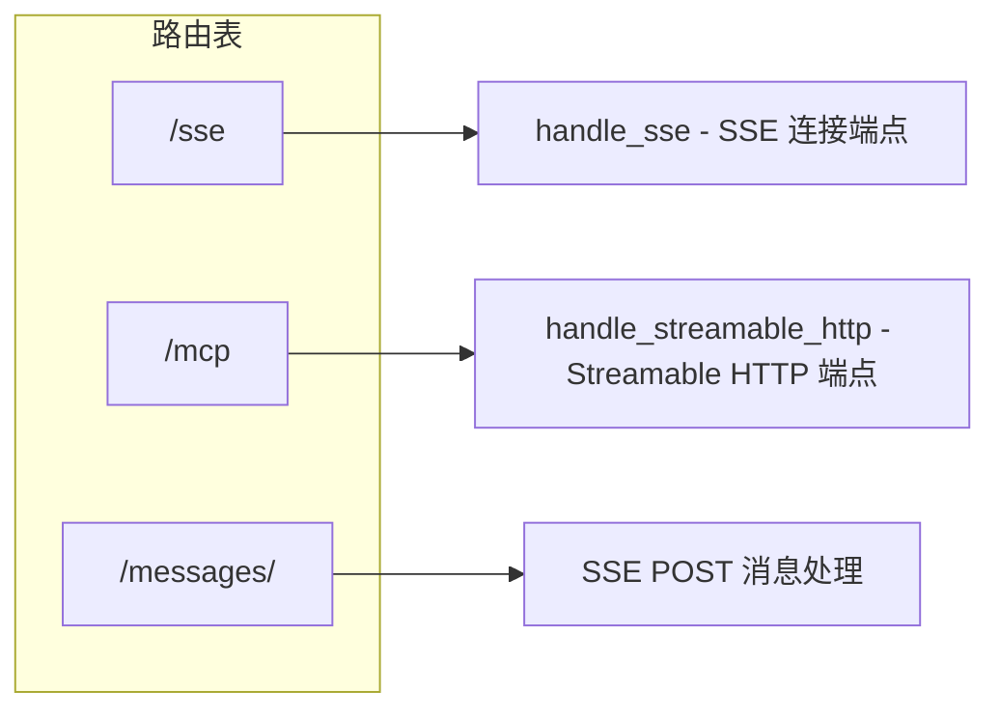
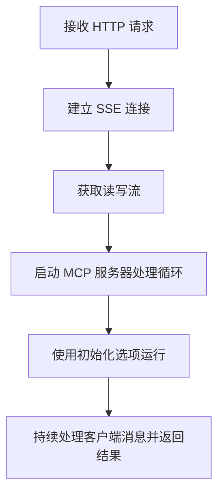
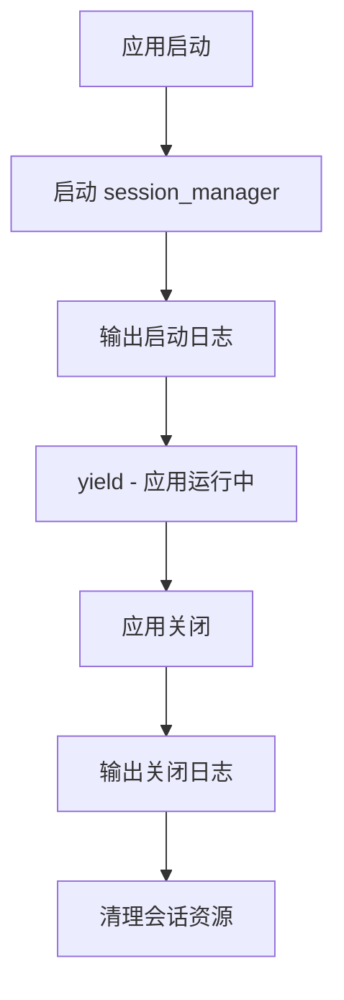
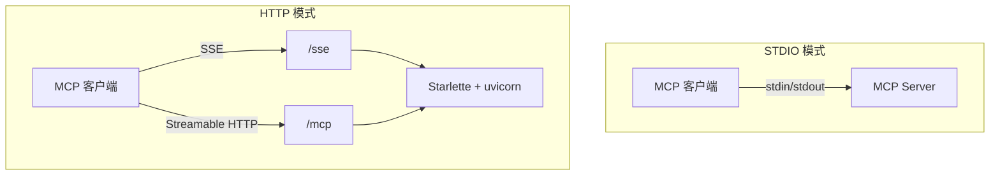
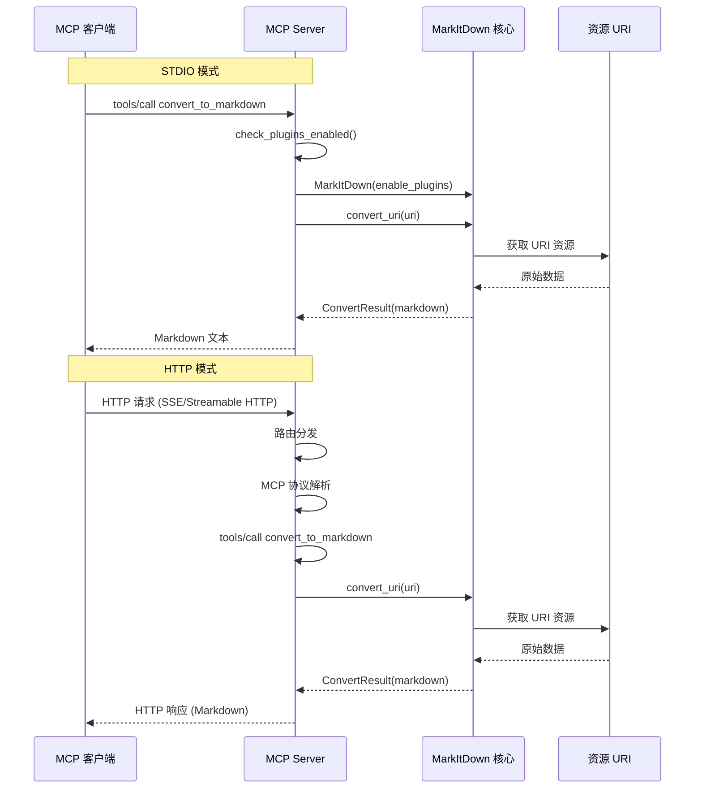

# MCP Server 模块

## 简介

MCP Server 模块是 markitdown-CN 项目的 Model Context Protocol (MCP) 服务层，将 markitdown 的核心文档转换能力封装为标准的 MCP 服务。该模块支持两种传输方式：STDIO（标准输入输出）和 HTTP（包含 SSE 与 Streamable HTTP 两种子模式），使得任何支持 MCP 协议的客户端（如 AI 助手、IDE 插件等）均可通过统一接口调用文档转换功能。

该模块位于独立的 `markitdown-mcp` 包中，通过 MCP 协议对外暴露 `convert_to_markdown` 工具，支持将 `http:`、`https:`、`file:` 和 `data:` URI 指向的资源转换为 Markdown 格式。

---

## 模块架构

### 组件总览



### 函数职责

| 函数 | 类型 | 职责 |
|------|------|------|
| `main` | 入口函数 | 命令行参数解析、传输方式选择、服务启动 |
| `convert_to_markdown` | MCP 工具 | 将 URI 指向的资源转换为 Markdown |
| `check_plugins_enabled` | 辅助函数 | 检查插件功能是否通过环境变量启用 |
| `create_starlette_app` | 工厂函数 | 创建 Starlette Web 应用，配置路由和生命周期 |
| `handle_sse` | 请求处理器 | 处理 SSE (Server-Sent Events) 连接 |
| `handle_streamable_http` | 请求处理器 | 处理 Streamable HTTP 连接 |
| `lifespan` | 上下文管理器 | 管理 StreamableHTTP 会话的生命周期 |

---

## 核心组件详解

### main — 服务入口

`main` 是整个 MCP 服务的启动入口，负责解析命令行参数并根据用户选择启动不同的传输模式。

#### 命令行参数

| 参数 | 类型 | 默认值 | 说明 |
|------|------|--------|------|
| `--http` | 布尔标志 | `False` | 启用 Streamable HTTP + SSE 传输模式 |
| `--sse` | 布尔标志 | `False` | `--http` 的废弃别名 |
| `--host` | 字符串 | `127.0.0.1` | 绑定地址 |
| `--port` | 整数 | `3001` | 监听端口 |

#### 启动流程



#### 安全警告

当用户将服务绑定到非 localhost 地址（如 `0.0.0.0`）时，服务会输出醒目的安全警告：

- 服务器无认证机制
- 服务以当前用户权限运行
- 网络上的任何进程或用户均可访问
- 可读取当前用户可访问的文件和网络资源

---

### convert_to_markdown — 核心 MCP 工具

`convert_to_markdown` 是通过 MCP 协议暴露给客户端的核心工具函数，接受一个 URI 参数并返回转换后的 Markdown 文本。

#### 支持的 URI 方案

| URI 方案 | 说明 |
|----------|------|
| `http:` / `https:` | 从网络 URL 获取资源并转换 |
| `file:` | 从本地文件系统读取资源并转换 |
| `data:` | 从 data URI 内联数据转换 |

#### 处理流程



#### 插件控制

转换实例创建时，`enable_plugins` 参数由 `check_plugins_enabled()` 决定。当插件启用时，MarkItDown 可以加载第三方插件扩展支持的文档格式。

---

### check_plugins_enabled — 插件开关检测

通过环境变量 `MARKITDOWN_ENABLE_PLUGINS` 控制插件功能是否启用。

#### 判断逻辑

| 环境变量值 | 结果 |
|------------|------|
| `"true"` / `"1"` / `"yes"` (不区分大小写) | `True` — 启用插件 |
| 其他值或未设置 | `False` — 禁用插件 |

默认值为 `"false"`，即插件默认禁用，需要用户显式开启。

---

### create_starlette_app — Web 应用工厂

`create_starlette_app` 创建一个 Starlette ASGI 应用，同时支持 SSE 和 Streamable HTTP 两种 MCP 传输协议。

#### 路由配置



| 路由 | 方法 | 功能 | 传输协议 |
|------|------|------|----------|
| `/sse` | GET | SSE 连接端点，建立长连接 | SSE |
| `/mcp` | 多种 | Streamable HTTP 端点 | Streamable HTTP |
| `/messages/` | POST | SSE 模式下的客户端消息发送 | SSE |

#### 内部组件

- **SseServerTransport**：管理 SSE 连接，处理客户端到服务器的消息
- **StreamableHTTPSessionManager**：管理 Streamable HTTP 会话，配置为无状态 (`stateless=True`) 和 JSON 响应 (`json_response=True`) 模式

---

### handle_sse — SSE 连接处理

`handle_sse` 处理 SSE (Server-Sent Events) 协议的连接请求。

#### 处理流程



SSE 模式下，客户端通过 GET 请求建立长连接，服务器通过 SSE 推送响应；客户端通过 POST `/messages/` 发送后续请求。

---

### handle_streamable_http — Streamable HTTP 处理

`handle_streamable_http` 处理 Streamable HTTP 协议的请求，将所有请求委托给 `StreamableHTTPSessionManager` 处理。

该函数采用 ASGI 接口风格（`scope`, `receive`, `send`），与 Starlette 的 Mount 路由兼容。

Streamable HTTP 模式特点：
- 无状态 (`stateless=True`)：每个请求独立处理
- JSON 响应 (`json_response=True`)：返回标准 JSON 格式

---

### lifespan — 应用生命周期管理

`lifespan` 是一个异步上下文管理器，管理 StreamableHTTP 会话管理器的生命周期。



---

## 传输模式对比



| 特性 | STDIO 模式 | HTTP 模式 |
|------|----------|----------|
| 传输方式 | 标准输入/输出 | HTTP + SSE / Streamable HTTP |
| 启动命令 | `markitdown-mcp` | `markitdown-mcp --http` |
| 默认端口 | 不适用 | 3001 |
| 默认地址 | 不适用 | 127.0.0.1 |
| 适用场景 | 本地 IDE 插件、命令行工具 | 远程服务、多客户端共享 |
| 认证机制 | 无（本地进程隔离） | 无（需网络隔离） |

---

## 完整数据流



---

## 依赖关系

### 内部依赖

- `main` 依赖 `create_starlette_app` 和 MCP 服务器实例
- `create_starlette_app` 内部定义 `handle_sse`、`handle_streamable_http` 和 `lifespan`
- `convert_to_markdown` 依赖 `check_plugins_enabled` 和 MarkItDown 核心库

### 外部依赖

| 依赖 | 类型 | 用途 |
|------|------|------|
| `mcp` (Python SDK) | MCP 协议库 | MCP 服务器框架、工具注册、协议处理 |
| `Starlette` | ASGI 框架 | HTTP 路由、中间件、生命周期管理 |
| `uvicorn` | ASGI 服务器 | HTTP 服务监听和请求处理 |
| `MarkItDown` | 核心库 | 文档到 Markdown 的实际转换逻辑 |

### 环境变量

| 变量名 | 默认值 | 说明 |
|--------|--------|------|
| `MARKITDOWN_ENABLE_PLUGINS` | `"false"` | 是否启用 MarkItDown 插件扩展 |

### 与其他模块的关系

- 本模块是 MarkItDown 核心转换能力的服务化封装，实际转换逻辑委托给 MarkItDown 核心库
- 核心库中的 [Media_Converters](Media_Converters.md) 和 [DOCX_Math_Utils](DOCX_Math_Utils.md) 等模块在转换过程中被间接调用
- 本模块不包含任何转换逻辑，仅负责协议处理、传输和服务编排

---

## 安全考虑

### 无认证设计

MCP Server 当前不实现任何认证机制。在 STDIO 模式下，安全性由进程隔离保证；在 HTTP 模式下，需要用户自行通过网络隔离（如防火墙规则、反向代理认证等）保护服务。

### 本地绑定默认

HTTP 模式默认绑定 `127.0.0.1`，仅允许本地访问。若用户显式指定其他地址，服务会输出安全警告。

### 插件默认禁用

插件功能默认禁用（`MARKITDOWN_ENABLE_PLUGINS=false`），防止未经审查的第三方插件被执行。用户需显式设置环境变量启用。

---

## 错误处理

| 场景 | 处理方式 |
|------|----------|
| HTTP 模式下指定 host/port 但未启用 HTTP | 解析参数时报错并退出 |
| 资源 URI 无法访问 | MarkItDown 核心库抛出异常，MCP 返回错误给客户端 |
| 插件启用但插件加载失败 | 由 MarkItDown 核心库处理，不影响基础转换功能 |
| SSE 连接断开 | `async with` 上下文管理器自动清理资源 |
| Streamable HTTP 会话异常 | `StreamableHTTPSessionManager` 内部处理 |

---

## 部署指南

### STDIO 模式（默认）

```bash
markitdown-mcp
```

适用于本地 IDE 插件或命令行工具，通过标准输入输出与 MCP 客户端通信。

### HTTP 模式

```bash
# 默认本地访问
markitdown-mcp --http

# 自定义端口
markitdown-mcp --http --port 8080

# 启用插件
MARKITDOWN_ENABLE_PLUGINS=true markitdown-mcp --http
```

适用于远程部署或多客户端共享场景，支持 SSE 和 Streamable HTTP 两种子协议。

---

## 扩展指南

### 添加新的 MCP 工具

1. 在模块中定义新的异步函数，使用 `@mcp.tool()` 装饰器注册
2. 在函数内调用 MarkItDown 核心库的相关 API
3. 客户端可通过 MCP 协议的 `tools/list` 发现新工具

### 添加认证机制

可在 `create_starlette_app` 中添加 Starlette 中间件实现认证：

- API Key 认证：添加中间件检查请求头
- OAuth2：集成 Starlette 的 OAuth 支持
- 反向代理：部署时在前端 Nginx/Caddy 层实现认证
