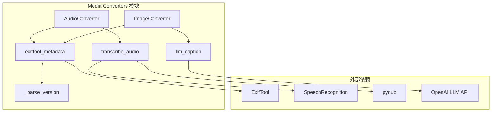
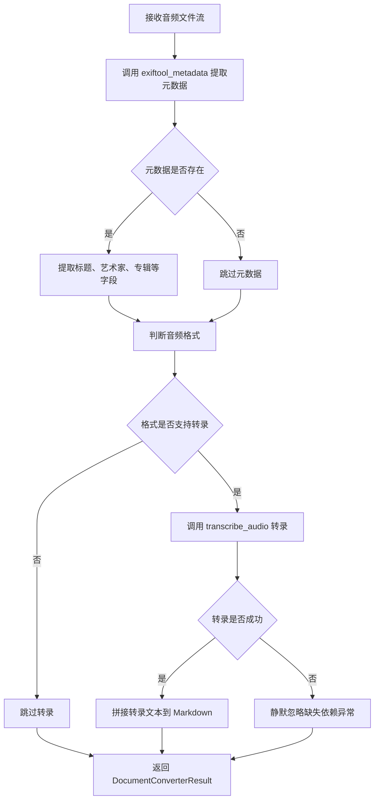
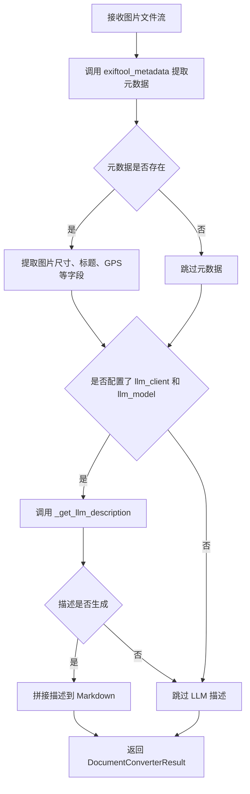
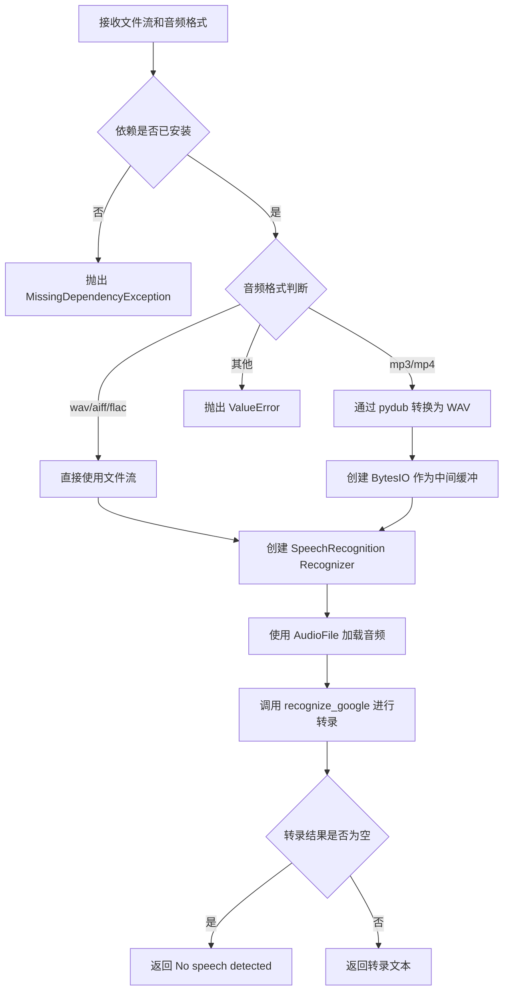
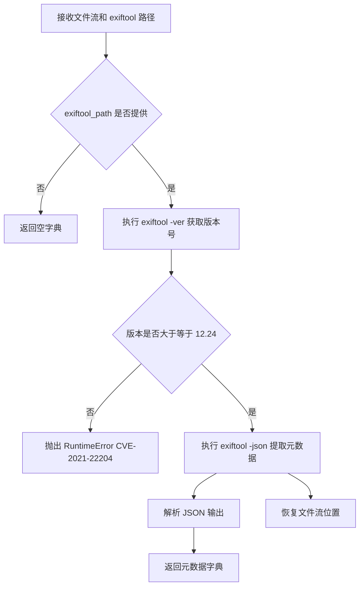
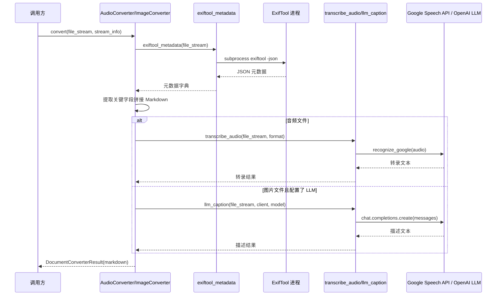

# Media Converters 模块

## 简介

Media Converters 模块是 markitdown-CN 项目中负责多媒体文件（音频和图片）转换为 Markdown 格式的核心模块。该模块通过元数据提取、语音转录和多模态大语言模型描述等多种技术手段，将非结构化的媒体文件内容转化为结构化的 Markdown 文本，从而支持下游的文档处理和信息检索场景。

模块设计遵循插件化架构，`AudioConverter` 和 `ImageConverter` 均继承自 `DocumentConverter` 基类，通过 `accepts()` 方法实现文件类型的自动识别与分发，通过 `convert()` 方法完成实际的转换逻辑。底层依赖 ExifTool 进行元数据提取，依赖 SpeechRecognition 进行语音转录，并可对接 OpenAI 兼容的多模态 LLM 生成图片描述。

---

## 模块架构

### 组件总览

### 类与函数的职责关系

| 组件 | 类型 | 职责 |
|------|------|------|
| `AudioConverter` | 类 | 音频文件的完整转换流程：元数据提取 + 语音转录 |
| `ImageConverter` | 类 | 图片文件的完整转换流程：元数据提取 + LLM 描述生成 |
| `transcribe_audio` | 函数 | 底层音频转录工具函数 |
| `llm_caption` | 函数 | 底层 LLM 图片描述工具函数 |
| `exiftool_metadata` | 函数 | 通过 ExifTool 提取文件元数据 |
| `_parse_version` | 函数 | 解析 ExifTool 版本号（内部辅助） |

---

## 核心组件详解

### AudioConverter 类

`AudioConverter` 继承自 `DocumentConverter`，负责将音频文件转换为 Markdown 文本。它组合了元数据提取和语音转录两种能力。

#### 支持的文件类型

通过 `accepts()` 方法，AudioConverter 支持以下音频格式的判断：

- 基于文件扩展名：`ACCEPTED_FILE_EXTENSIONS` 列表中的扩展名
- 基于 MIME 类型：以 `ACCEPTED_MIME_TYPE_PREFIXES` 中任一前缀开头的 MIME 类型

#### 转换流程

#### 元数据字段

AudioConverter 从 ExifTool 返回的元数据中提取以下字段：

- `Title` — 音频标题
- `Artist` / `Author` / `Band` — 艺术家/作者/乐队
- `Album` — 专辑名
- `Genre` — 流派
- `Track` — 音轨号
- `DateTimeOriginal` / `CreateDate` — 创建时间
- `NumChannels` — 声道数
- `SampleRate` — 采样率
- `AvgBytesPerSec` — 平均字节率
- `BitsPerSample` — 位深度

> **注意**：`Duration` 字段因从内存读取时值不正确，已被显式排除。

#### 转录支持的音频格式

| 扩展名/MIME | 转录格式标识 |
|------------|-------------|
| `.wav` / `audio/x-wav` | `wav` |
| `.mp3` / `audio/mpeg` | `mp3` |
| `.mp4` / `.m4a` / `video/mp4` | `mp4` |
| 其他 | 不进行转录 |

---

### ImageConverter 类

`ImageConverter` 继承自 `DocumentConverter`，负责将图片文件转换为 Markdown 文本。它结合了元数据提取和多模态 LLM 图片描述两种能力。

#### 转换流程

#### 元数据字段

ImageConverter 从 ExifTool 返回的元数据中提取以下字段：

- `ImageSize` — 图片尺寸
- `Title` / `Caption` / `Description` — 标题/说明
- `Keywords` — 关键词
- `Artist` / `Author` — 作者
- `DateTimeOriginal` / `CreateDate` — 创建时间
- `GPSPosition` — GPS 定位信息

#### LLM 描述生成

`_get_llm_description()` 方法的内部流程：

1. **提示词准备**：若未提供自定义 prompt，则使用默认值 `"Write a detailed caption for this image."`
2. **内容类型推断**：优先使用 `stream_info.mimetype`，否则通过 `mimetypes.guess_type()` 推断，最终回退到 `application/octet-stream`
3. **Base64 编码**：将图片流读取并编码为 Base64，构建 data URI
4. **API 调用**：按照 OpenAI Chat Completions 格式构造多模态消息，调用 LLM 生成图片描述
5. **流位置恢复**：在读取流内容后，通过 `seek()` 恢复流的读取位置，确保后续操作不受影响

---

### transcribe_audio 函数

`transcribe_audio` 是音频转录的底层工具函数，封装了 SpeechRecognition 库的调用逻辑。

#### 处理流程

#### 关键设计

- **可选依赖管理**：通过模块级变量 `_dependency_exc_info` 检测 `speech_recognition` 和 `pydub` 是否已安装。若未安装，在调用时抛出 `MissingDependencyException`，附带安装指引
- **格式转换**：对于 MP3 和 MP4 格式，先通过 pydub 转换为 WAV 格式后再交给 SpeechRecognition 处理
- **转录引擎**：使用 Google Web Speech API (`recognize_google`) 进行在线语音识别

---

### llm_caption 函数

`llm_caption` 是图片 LLM 描述的底层工具函数，与 `ImageConverter._get_llm_description()` 功能基本一致，提供独立的函数接口供其他模块调用。

#### 处理逻辑

1. 使用默认或自定义 prompt
2. 推断内容类型（MIME type）
3. 将图片编码为 Base64 并构造 data URI
4. 按照 OpenAI 多模态消息格式调用 Chat Completions API
5. 返回生成的描述文本

> **设计说明**：`llm_caption` 和 `ImageConverter._get_llm_description` 共享相同的调用模式，前者作为公共函数可被其他转换器（如 [DOCX_Math_Utils](DOCX_Math_Utils.md) 等模块）复用。

---

### exiftool_metadata 函数

`exiftool_metadata` 负责通过外部调用 ExifTool 命令行工具来提取文件的元数据。

#### 处理流程

#### 安全设计

- **版本检查**：ExifTool 12.24 以下版本存在 CVE-2021-22204 安全漏洞，函数会在执行前强制检查版本号，不满足要求时抛出运行时错误
- **流位置恢复**：通过 `try/finally` 确保文件流位置在读取后被恢复
- **编码处理**：使用 `locale.getpreferredencoding(False)` 解码 ExifTool 的输出，兼容不同操作系统平台的编码差异

### _parse_version 函数

`_parse_version` 是内部辅助函数，将形如 `"12.24"` 的版本字符串解析为整数元组 `(12, 24)`，用于版本比较。

---

## 数据流

---

## 依赖关系

### 内部依赖

- `AudioConverter` 依赖 `exiftool_metadata` 和 `transcribe_audio`
- `ImageConverter` 依赖 `exiftool_metadata` 和 `llm_caption`（通过 `_get_llm_description`）
- `exiftool_metadata` 依赖 `_parse_version`

### 外部依赖

| 依赖 | 类型 | 用途 | 是否可选 |
|------|------|------|----------|
| ExifTool (>=12.24) | 外部命令行工具 | 元数据提取 | 是（未安装时跳过） |
| `speech_recognition` | Python 库 | 语音转录 | 是（可选依赖组 `audio-transcription`） |
| `pydub` | Python 库 | 音频格式转换 | 是（可选依赖组 `audio-transcription`） |
| OpenAI Python SDK | Python 库 | 多模态 LLM 调用 | 是（需配置 `llm_client`） |

### 与其他模块的关系

- 本模块的 `AudioConverter` 和 `ImageConverter` 均实现 `DocumentConverter` 接口，由主转换器注册和调度
- `llm_caption` 函数可被其他需要图片描述的模块复用
- `exiftool_metadata` 作为通用元数据提取工具，理论上可服务于其他媒体类型的转换器

---

## 错误处理策略

| 场景 | 处理方式 |
|------|----------|
| ExifTool 未安装或路径未配置 | 返回空元数据字典，不影响后续流程 |
| ExifTool 版本过低 (<12.24) | 抛出 `RuntimeError`，提示安全漏洞信息 |
| SpeechRecognition 未安装 | 抛出 `MissingDependencyException`，附带安装命令 |
| 音频格式不支持转录 | `AudioConverter` 中设置 `audio_format=None`，跳过转录 |
| 转录过程异常 | 捕获 `MissingDependencyException` 后静默忽略 |
| LLM 调用失败 | `_get_llm_description` 捕获异常返回 `None` |
| 图片 Base64 编码失败 | 捕获异常返回 `None`，不影响元数据部分输出 |

---

## 扩展指南

### 添加新的媒体转换器

1. 创建新类继承 `DocumentConverter`
2. 实现 `accepts()` 方法定义支持的文件类型
3. 实现 `convert()` 方法编写转换逻辑
4. 复用 `exiftool_metadata` 获取元数据
5. 根据需要复用 `transcribe_audio` 或 `llm_caption`

### 添加新的音频转录引擎

当前仅支持 Google Web Speech API。若需添加其他引擎（如 Whisper），可在 `transcribe_audio` 中增加引擎选择逻辑，或创建新的转录函数。

### 自定义 LLM 描述行为

通过 `llm_prompt` 参数传入自定义提示词，可控制 LLM 生成的描述风格和关注点。例如针对特定领域的图片（医学影像、建筑图纸等）定制提示词。
