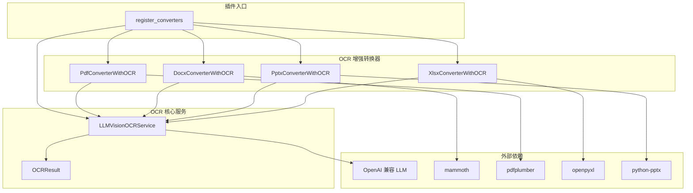
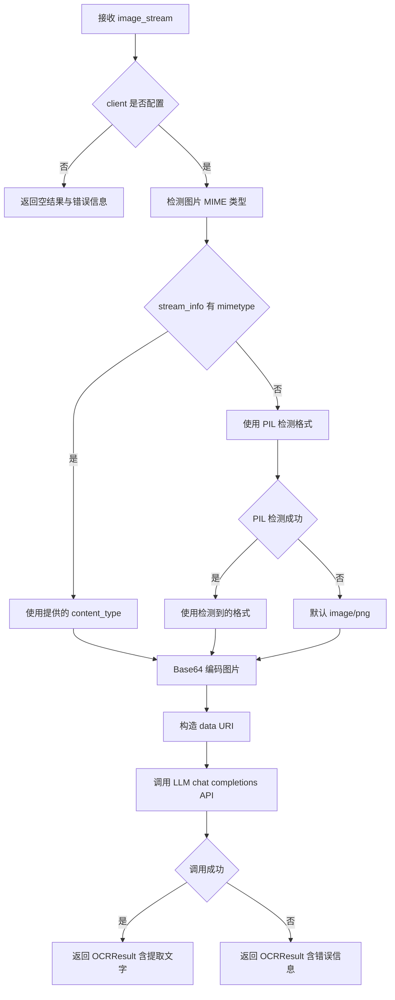
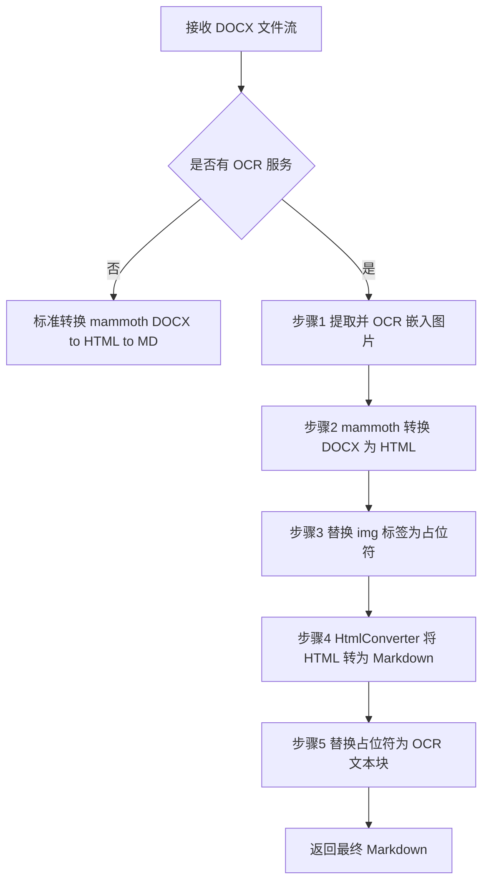
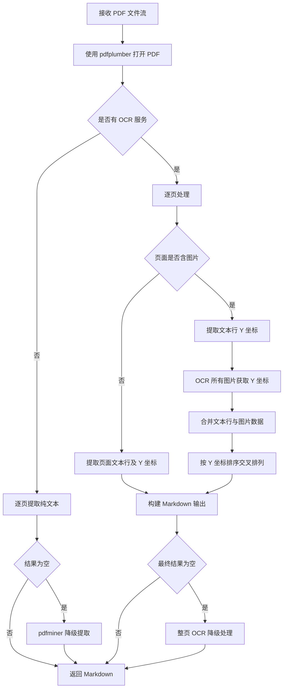
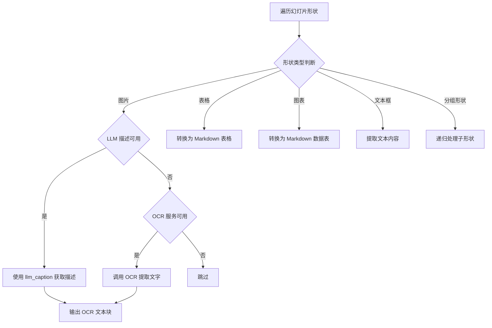
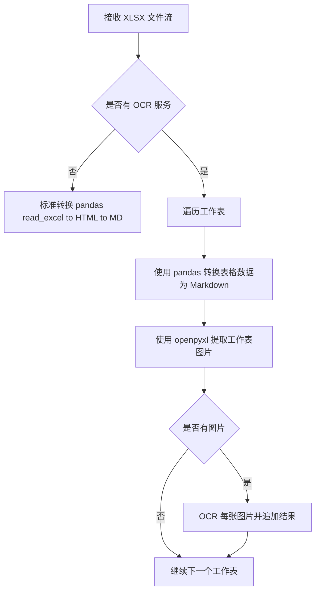
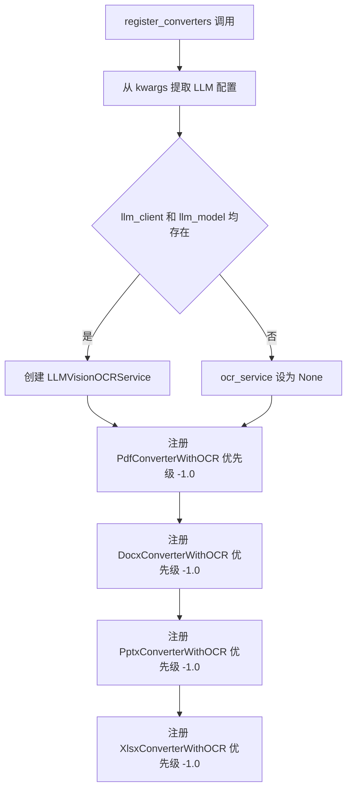
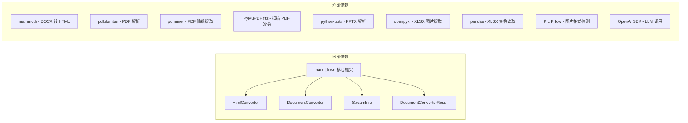
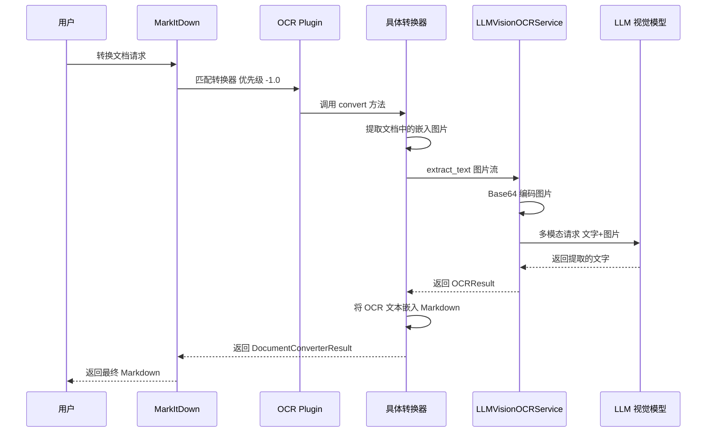

# OCR_Plugin 模块文档

## 概述

OCR_Plugin 是 markitdown-CN 项目中的核心插件模块，为 MarkItDown 文档转换框架提供 **基于 LLM 视觉模型的光学字符识别（OCR）能力**。该插件通过替换内置转换器，使系统能够从 PDF、DOCX、PPTX、XLSX 等文档中的嵌入图片自动提取文字内容，并将 OCR 结果以内联方式嵌入到输出的 Markdown 文档中。

### 核心能力

- **多格式支持**：覆盖 PDF、DOCX、PPTX、XLSX 四种主流办公文档格式
- **LLM 视觉 OCR**：利用 OpenAI 兼容的视觉大模型（如 GPT-4o、Gemini）进行文字识别
- **智能降级**：PDF 转换支持扫描型文档的整页 OCR 降级处理
- **插件化架构**：以优先级机制替换内置转换器，即插即用
- **统一输出格式**：所有 OCR 结果使用一致的 Markdown 标记格式

---

## 架构概览



---

## 组件详解

### 1. OCRResult — OCR 结果数据类

`OCRResult` 是一个轻量级数据类，封装单次 OCR 操作的返回结果。

| 字段 | 类型 | 说明 |
|------|------|------|
| `text` | `str` | 提取的文字内容 |
| `confidence` | `float \| None` | 置信度评分（可选） |
| `backend_used` | `str \| None` | 使用的后端名称，如 `"llm_vision"` |
| `error` | `str \| None` | 错误信息（如发生异常） |

该数据类在所有转换器中统一使用，确保 OCR 结果的一致性。

---

### 2. LLMVisionOCRService — LLM 视觉 OCR 服务

`LLMVisionOCRService` 是本模块的核心引擎，通过 OpenAI 兼容的视觉大模型实现图片文字提取。

#### 初始化参数

| 参数 | 类型 | 说明 |
|------|------|------|
| `client` | `Any` | OpenAI 兼容的 API 客户端 |
| `model` | `str` | 模型名称（如 `gpt-4o`、`gemini-2.0-flash`） |
| `default_prompt` | `str \| None` | 自定义 OCR 提示词 |

#### 文字提取流程



#### 核心方法 `extract_text`

- 将图片流编码为 Base64 Data URI
- 构造多模态消息（文字提示 + 图片 URL）
- 调用 LLM 的 `chat.completions.create` 接口
- 默认提示词要求模型仅返回提取的文字，保持原始布局

---

### 3. DocxConverterWithOCR — DOCX 增强转换器

继承自 `HtmlConverter`，在标准 DOCX 转 Markdown 流程中增加图片 OCR 能力。

#### 转换流程（OCR 模式）



#### 关键内部方法

| 方法 | 功能 |
|------|------|
| `_extract_and_ocr_images` | 遍历 DOCX 文档关系，提取所有图片资源并调用 OCR |
| `_inject_placeholders` | 用正则替换 HTML 中的 `` 标签为编号占位符，返回有序 OCR 文本列表 |

#### 占位符机制

为避免 Markdown 转换过程中 OCR 文本中的特殊字符（如 `*`、`_`）被转义，采用两阶段替换策略：

1. **注入阶段**：将 `` 标签替换为安全占位符（如 `{{OCR_PLACEHOLDER_0}}`）
2. **回填阶段**：在 HTML→Markdown 转换完成后，将占位符替换为带标记的 OCR 文本块

---

### 4. PdfConverterWithOCR — PDF 增强转换器

继承自 `DocumentConverter`，是本模块中最复杂的转换器，支持三种处理模式。

#### 转换流程



#### 三种处理模式

| 模式 | 触发条件 | 处理方式 |
|------|----------|----------|
| 标准模式 | 无 OCR 服务 | 使用 pdfplumber 逐页提取文本 |
| OCR 交叉模式 | 有 OCR 服务且页面含图片 | 提取文本行和图片的 Y 坐标，按位置交叉排列 |
| 整页 OCR 降级 | 有 OCR 服务但文本提取为空 | 将整页渲染为图片后执行 OCR |

#### 整页 OCR 降级 `_ocr_full_pages`

当标准文本提取和 pdfplumber 处理均返回空结果时，系统将其视为扫描型 PDF：

1. 使用 pdfplumber 以 300 DPI 渲染每页为 PNG
2. 若 pdfplumber 渲染失败，降级使用 PyMuPDF（fitz）
3. 对每页渲染结果调用 OCR 服务

#### 辅助函数 `_extract_images_from_page`

独立的 PDF 页面图片提取函数，使用多种策略检测图片：

- **方法 1**：`page.images` 标准接口
- **方法 2**：`page.objects["image"]` 底层对象
- **方法 3**：遍历所有对象查找 image/xobject 类型

图片获取也采用双重策略：
- **策略 A**：直接从 stream 对象获取图片数据
- **策略 B**：通过 pdfplumber 的 `within_bbox` 裁剪页面区域并渲染

---

### 5. PptxConverterWithOCR — PPTX 增强转换器

继承自 `DocumentConverter`，在遍历幻灯片形状时增加图片 OCR 降级能力。

#### 形状处理流程



#### 特殊处理

- **图片处理优先级**：先尝试 LLM 描述（`llm_caption`），失败后降级到 OCR
- **形状排序**：按 `(top, left)` 坐标排序，确保内容按视觉顺序输出
- **表格转换**：通过 HTML 中间格式转换为 Markdown 表格
- **图表转换**：提取分类名和系列数据，生成 Markdown 表格

---

### 6. XlsxConverterWithOCR — XLSX 增强转换器

继承自 `DocumentConverter`，在标准 Excel 表格转换基础上增加工作表图片 OCR。

#### 转换流程



#### 图片位置追踪

XLSX 转换器通过 openpyxl 的 `_images` 属性访问工作表图片，并尝试从锚点信息（`anchor._from`）获取单元格引用位置，使用 `_column_number_to_letter` 将列号转换为 Excel 列字母。

---

### 7. register_converters — 插件注册入口

插件的核心入口函数，负责创建 OCR 服务并将四个增强转换器注册到 MarkItDown 实例。

#### 注册流程



#### 优先级机制

| 转换器 | 优先级 | 说明 |
|--------|--------|------|
| OCR 增强转换器 | `-1.0` | 优先于内置转换器执行 |
| 内置转换器 | `0.0` | 默认优先级 |

通过设置 `-1.0` 优先级，OCR 增强转换器在内置转换器之前被匹配，从而在插件启用时自动替换默认行为。

#### 支持的 kwargs 参数

| 参数 | 说明 |
|------|------|
| `llm_client` | OpenAI 兼容的 API 客户端（必需） |
| `llm_model` | 模型名称，如 `gpt-4o`（必需） |
| `llm_prompt` | 自定义 OCR 提示词（可选） |

---

## 统一 OCR 输出格式

所有转换器使用统一的 OCR 文本块标记格式：

```
*[Image OCR]
提取的文字内容
[End OCR]*
```

该格式使用 Markdown 斜体标记（`*`）包裹，便于后续解析和样式区分。

---

## 依赖关系



---

## 数据流全景



---

## 与 Sample_Plugin 的关系

OCR_Plugin 与 [Sample_Plugin](Sample_Plugin.md) 同为 markitdown-CN 的插件模块，共享相同的插件注册接口（`register_converters` 函数签名）。两者的区别在于：

- **OCR_Plugin**：替换内置转换器，增加 OCR 能力，处理 PDF/DOCX/PPTX/XLSX
- **Sample_Plugin**：扩展现有转换器，增加对新文件格式（如 RTF）的支持

---

## 错误处理策略

| 场景 | 处理方式 |
|------|----------|
| 缺少依赖包 | 抛出 `MissingDependencyException`，提示安装对应 feature |
| LLM 客户端未配置 | 返回空 OCRResult 并携带错误信息 |
| 单张图片 OCR 失败 | 捕获异常并跳过，继续处理其他图片 |
| PDF 文本提取为空 | 降级到 pdfminer，再降级到整页 OCR |
| pdfplumber 渲染失败 | 降级到 PyMuPDF 进行页面渲染 |
| PPTX 图表类型不支持 | 返回 `[unsupported chart]` 占位文本 |
| XLSX 表格读取失败 | 跳过该表格，继续处理图片 |
