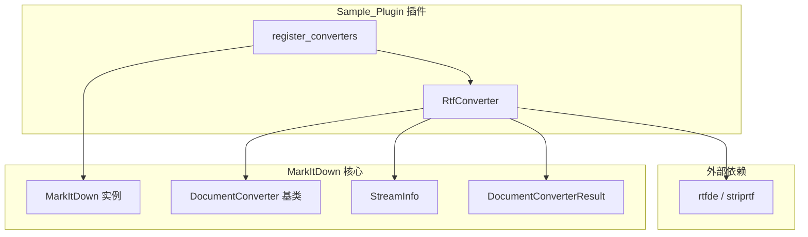
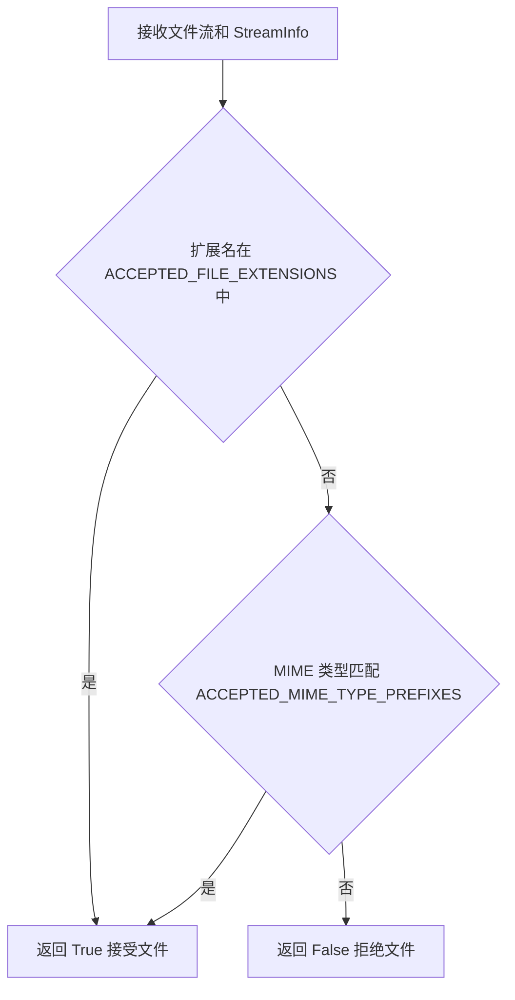
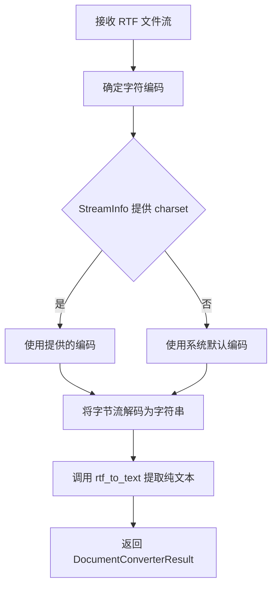
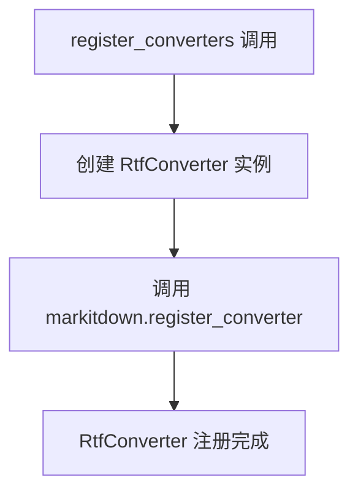
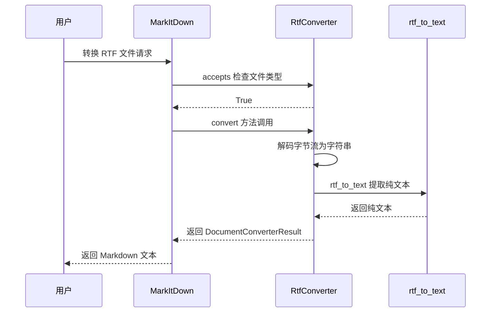
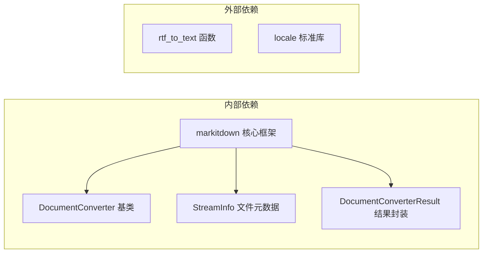

# Sample_Plugin 模块文档

## 概述

Sample_Plugin 是 markitdown-CN 项目中的示例插件模块，为 MarkItDown 文档转换框架提供 **RTF（富文本格式）文件转换能力**。该插件将 RTF 文件转换为纯文本 Markdown，是理解 MarkItDown 插件开发模式的最佳参考实现。

### 核心能力

- **RTF 格式支持**：识别并转换 RTF 文档为 Markdown 纯文本
- **字符编码自适应**：优先使用 StreamInfo 提供的字符集，否则回退到系统默认编码
- **最小化实现**：以最少代码展示完整的插件开发模式
- **即插即用**：通过标准 `register_converters` 接口无缝集成

---

## 架构概览

---

## 组件详解

### 1. RtfConverter — RTF 转换器

`RtfConverter` 继承自 `DocumentConverter`，负责将 RTF 格式文档转换为纯文本 Markdown。

#### 文件识别逻辑

`accepts` 方法通过文件扩展名和 MIME 类型双重判断是否支持输入文件：

| 判断依据 | 常量 | 说明 |
|----------|------|------|
| 文件扩展名 | `ACCEPTED_FILE_EXTENSIONS` | 接受的 RTF 文件扩展名列表 |
| MIME 类型前缀 | `ACCEPTED_MIME_TYPE_PREFIXES` | 接受的 RTF MIME 类型前缀列表 |

#### 转换流程

#### 编码策略

| 优先级 | 来源 | 说明 |
|--------|------|------|
| 1 | `stream_info.charset` | 来自文件元数据的字符集 |
| 2 | `locale.getpreferredencoding()` | 系统默认编码（如 UTF-8、GBK） |

---

### 2. register_converters — 插件注册入口

插件入口函数，负责创建 `RtfConverter` 实例并注册到 MarkItDown。

#### 与 OCR_Plugin 注册机制的对比

| 特性 | Sample_Plugin | [OCR_Plugin](OCR_Plugin.md) |
|------|---------------|------------------|
| 注册转换器数量 | 1 个 | 4 个 |
| 默认优先级 | `0.0`（默认） | `-1.0`（优先） |
| 依赖外部服务 | 无 | 需要 LLM 客户端 |
| 构造函数参数 | 无 | OCR 服务实例 |

---

## 数据流全景

---

## 插件开发模式参考

Sample_Plugin 作为示例插件，展示了 MarkItDown 插件开发的核心模式：

### 基本步骤

1. **继承 DocumentConverter**：创建自定义转换器类
2. **实现 `accepts` 方法**：定义支持的文件类型
3. **实现 `convert` 方法**：定义转换逻辑
4. **导出 `register_converters`**：注册转换器到 MarkItDown

### 设计原则

| 原则 | 说明 |
|------|------|
| 单一职责 | 每个转换器只处理一种文件格式 |
| 防御性编程 | 使用 try-except 处理编码和解析错误 |
| 优雅降级 | 优先使用精确编码，失败时回退到系统默认 |
| 零配置 | 无需额外参数即可工作 |

---

## 依赖关系

---

## 与 OCR_Plugin 的关系

Sample_Plugin 与 [OCR_Plugin](OCR_Plugin.md) 同为 markitdown-CN 的插件模块，但定位不同：

- **Sample_Plugin**：示例插件，扩展现有格式支持（RTF），实现简单，无外部服务依赖
- **OCR_Plugin**：功能插件，替换内置转换器增加 OCR 能力，实现复杂，需要 LLM 服务

两者共享相同的插件接口规范，开发者可参考 Sample_Plugin 的实现模式开发自定义插件。
