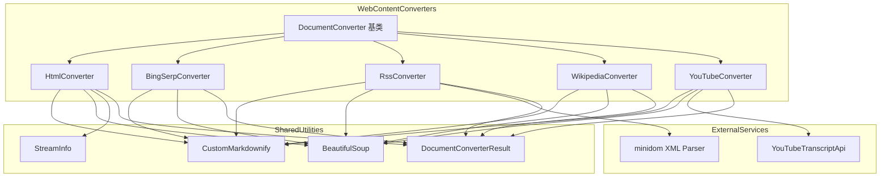
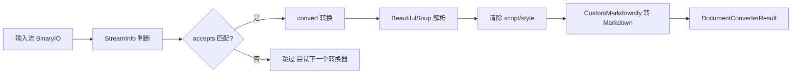
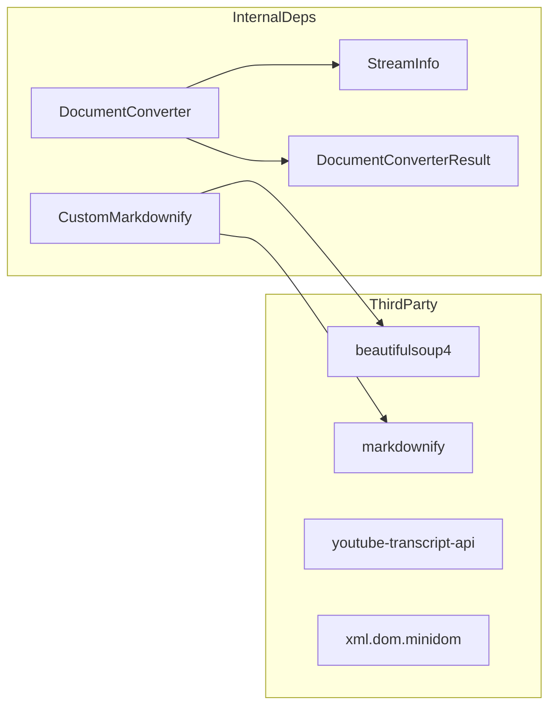

# Web_Content_Converters 模块

## 模块简介

Web_Content_Converters 是 markitdown-CN 项目中负责 **网页类内容转换** 的核心模块。该模块将来自不同 Web 来源的 HTML 内容（普通网页、搜索引擎结果页、RSS/Atom 订阅源、Wikipedia 百科页面、YouTube 视频页面）统一转换为结构化的 Markdown 文档。

所有转换器均继承自基类 `DocumentConverter`，遵循统一的 `accepts()` / `convert()` 接口契约，使得上层调度器（参见 [MarkItDown](MarkItDown.md)）可以通过一致的管线（pipeline）自动选择并调用合适的转换器。

## 核心功能一览

| 转换器 | 输入类型 | 核心能力 |
|---|---|---|
| HtmlConverter | 通用 HTML | HTML → Markdown，支持递归深度降级 |
| BingSerpConverter | Bing 搜索结果页 | 解析有机搜索结果，解码 Base64 重定向链接 |
| RssConverter | RSS / Atom 订阅 | 识别 Feed 类型，解析频道与条目 |
| WikipediaConverter | Wikipedia 页面 | 提取正文区域 `mw-content-text` |
| YouTubeConverter | YouTube 视频页 | 提取元数据 + 字幕（Transcript） |

---

## 架构总览



---

## 转换流程



---

## 各组件详细说明

### 1. HtmlConverter — 通用 HTML 转换器

**源文件：** `_html_converter.py`

**职责：** 处理任意 `text/html` 类型的内容，是最基础、最通用的 Web 内容转换器。其他专用转换器（如 BingSerpConverter、WikipediaConverter）在内部逻辑中也会间接依赖 HtmlConverter 的转换能力。

**工作流程：**

1. **接受判断 (`accepts`)：** 根据文件扩展名（`.html`、`.htm` 等）或 MIME 类型前缀（`text/html`）判断是否处理。
2. **HTML 解析：** 使用 BeautifulSoup 的 `html.parser` 解析输入流，自动检测字符编码。
3. **清理无关元素：** 移除所有 `<script>` 和 `<style>` 标签。
4. **正文提取：** 优先查找 `<body>` 元素进行 Markdown 转换；若不存在则对整个文档转换。
5. **递归降级：** 当 HTML 嵌套过深导致 `RecursionError` 时，自动降级为 `get_text()` 提取纯文本，并通过 `warnings.warn()` 发出警告。可通过 `strict=True` 参数禁止降级。

**特殊接口：**

- `convert_string(html_content, url=None, **kwargs)` — 便捷方法，接受 HTML 字符串直接转换。许多其他转换器在内部产生 HTML 中间结果时，可调用此方法完成最终的 Markdown 转换。

---

### 2. BingSerpConverter — Bing 搜索结果页转换器

**源文件：** `_bing_serp_converter.py`

**职责：** 专门处理 Bing 搜索引擎的结果页面（SERP），提取有机搜索结果（organic results）并转为 Markdown。

**工作流程：**

1. **URL 匹配：** 通过正则 `^https://www\.bing\.com/search\?q=` 严格匹配 Bing 搜索 URL。
2. **查询提取：** 从 URL 参数中解析搜索关键词 `q`。
3. **DOM 清理：** 为 `tptt` 类元素追加空格、移除 `algoSlug_icon` 图标元素。
4. **结果解析：** 遍历所有 `b_algo` 类的搜索结果元素。
5. **重定向解码：** 解析 Bing 的重定向 URL — 从 `u` 参数中提取 Base64URL 编码的真实目标地址并还原。
6. **Markdown 输出：** 将各结果拼接为结构化的 Markdown，格式为 `## A Bing search for '{query}' found the following results:`。

**注意事项：** 源码注释建议优先使用 Bing API 而非页面抓取方式获取搜索结果。

---

### 3. RssConverter — RSS / Atom 订阅源转换器

**源文件：** `_rss_converter.py`

**职责：** 解析 RSS 2.0 和 Atom 两种标准的 Web 订阅 Feed，将频道信息和各条目转为 Markdown。

**工作流程：**

1. **类型识别 (`accepts`)：**
   - 精确匹配：通过 `.rss`、`.atom` 等扩展名或精确 MIME 类型直接接受。
   - 候选匹配：对于 `.xml` 等泛用扩展名，使用 `_check_xml()` 方法尝试解析 XML 并检查是否包含 `<rss>` 或 `<feed>`+`<entry>` 根元素。
2. **Feed 类型判断 (`_feed_type`)：** 根据 XML 根元素区分 RSS 和 Atom。
3. **RSS 解析 (`_parse_rss_type`)：** 提取 `<channel>` 下的标题、描述，遍历 `<item>` 获取标题、发布日期、描述及 `content:encoded` 全文。
4. **Atom 解析 (`_parse_atom_type`)：** 提取 `<feed>` 下的标题、副标题，遍历 `<entry>` 获取标题、更新时间、摘要及正文。
5. **HTML 内容处理：** 由于许多 RSS/Atom 条目的内容包含 HTML 标记，`_parse_content()` 方法使用 BeautifulSoup + `_CustomMarkdownify` 将其转为 Markdown。

**内部工具方法：**

- `_get_data_by_tag_name(element, tag_name)` — 从 XML DOM 中提取指定标签名的首个子元素文本。

---

### 4. WikipediaConverter — Wikipedia 百科页面转换器

**源文件：** `_wikipedia_converter.py`

**职责：** 针对 Wikipedia 页面进行优化处理，仅提取正文区域内容，避免导航栏、侧边栏等干扰信息。

**工作流程：**

1. **URL 匹配：** 通过正则 `^https?:\/\/[a-zA-Z]{2,3}\.wikipedia\.org\/` 匹配各语言版本的 Wikipedia URL（如 `en.wikipedia.org`、`zh.wikipedia.org`）。
2. **HTML 解析与清理：** 使用 BeautifulSoup 解析后移除 `<script>` 和 `<style>` 标签。
3. **正文定位：** 查找 `id="mw-content-text"` 的 `<div>` 元素作为正文容器。
4. **标题提取：** 查找 `class="mw-page-title-main"` 的 `<span>` 元素获取页面标题。
5. **Markdown 转换：** 将正文区域通过 `_CustomMarkdownify` 转为 Markdown，并在开头添加一级标题 `# {title}`。

---

### 5. YouTubeConverter — YouTube 视频页面转换器

**源文件：** `_youtube_converter.py`

**职责：** 处理 YouTube 视频页面，提取视频元数据（标题、播放量、关键词、时长、描述）及字幕文本。

**工作流程：**

1. **URL 匹配：** 匹配 `https://www.youtube.com/watch?` 开头的 URL，支持 URL 解码和转义字符处理。
2. **元数据提取：**
   - 从 `<meta>` 标签收集 `itemprop`、`property`、`name` 等属性对应的元数据。
   - 从 `<script>` 标签中的 `ytInitialData` JSON 对象递归搜索 `attributedDescriptionBodyText` 获取视频描述。
3. **结构化输出：**
   - 标题（`## {title}`）
   - 视频元数据区（`### Video Metadata`）：播放量、关键词、时长
   - 描述区（`### Description`）
4. **字幕获取：** 当 `youtube-transcript-api` 库可用时：
   - 从 URL 中解析视频 ID（`v` 参数）。
   - 调用 `YouTubeTranscriptApi.list()` 获取可用字幕列表。
   - 支持通过 `youtube_transcript_languages` 参数指定字幕语言偏好。
   - 内置重试机制（默认 3 次重试，间隔 2 秒）。
   - 当首选语言不可用时，尝试查找并翻译字幕。

**内部工具方法：**

- `_get(metadata, keys, default)` — 从元数据字典中按优先级获取第一个非空值。
- `_findKey(json, key)` — 递归搜索嵌套 JSON 结构中的指定键。
- `_retry_operation(operation, retries, delay)` — 通用重试逻辑。

---

## 共性设计模式

### accepts / convert 契约

所有转换器均实现两个核心方法：

```python
def accepts(self, file_stream, stream_info, **kwargs) -> bool:
    """判断当前转换器是否能处理该输入"""

def convert(self, file_stream, stream_info, **kwargs) -> DocumentConverterResult:
    """执行实际转换，返回 Markdown 结果"""
```

### _CustomMarkdownify 共享转换器

所有 Web 内容转换器共用一个 `_CustomMarkdownify` 实例来进行 HTML → Markdown 的实际转换。该组件封装了 `markdownify` 库并提供了自定义的标签处理逻辑。详见 [CustomMarkdownify](CustomMarkdownify.md)。

### StreamInfo 流信息

`StreamInfo` 对象贯穿整个转换管线，携带以下关键信息：
- `mimetype` — MIME 类型
- `extension` — 文件扩展名
- `charset` — 字符编码
- `url` — 来源 URL（对 URL 敏感型转换器至关重要）

详见 [StreamInfo](StreamInfo.md)。

---

## 依赖关系



| 依赖项 | 类型 | 用途 |
|---|---|---|
| `beautifulsoup4` | 第三方库 | HTML 解析与 DOM 操作 |
| `markdownify` | 第三方库 | HTML → Markdown 底层转换引擎 |
| `youtube-transcript-api` | 可选依赖 | YouTube 字幕获取 |
| `xml.dom.minidom` | 标准库 | RSS/Atom XML 解析 |
| `base64` / `binascii` | 标准库 | Bing 重定向 URL 解码 |
| `urllib.parse` | 标准库 | URL 解析与参数提取 |

---

## 错误处理与容错机制

| 转换器 | 容错策略 |
|---|---|
| HtmlConverter | `RecursionError` 时降级为纯文本提取；可通过 `strict=True` 禁用 |
| BingSerpConverter | Base64 解码失败时静默跳过（`UnicodeDecodeError` / `binascii.Error`） |
| RssConverter | `_parse_content` 中 BeautifulSoup 解析失败时返回原始内容 |
| WikipediaConverter | 未找到正文区域时回退到全文转换 |
| YouTubeConverter | 字幕获取失败时重试 3 次；元数据提取异常时静默跳过；无字幕时仅输出元数据 |

---

## 扩展指南

如需添加新的 Web 内容转换器，请遵循以下步骤：

1. 创建新文件 `_xxx_converter.py`，定义继承 `DocumentConverter` 的类。
2. 实现 `accepts()` 方法，通过 URL 模式、MIME 类型或扩展名精确匹配目标来源。
3. 实现 `convert()` 方法，使用 BeautifulSoup 解析 HTML 并通过 `_CustomMarkdownify` 转为 Markdown。
4. 返回 `DocumentConverterResult(markdown=..., title=...)`。
5. 在主模块的转换器注册列表中注册新转换器。

有关转换器注册机制，参见 [MarkItDown](MarkItDown.md)。