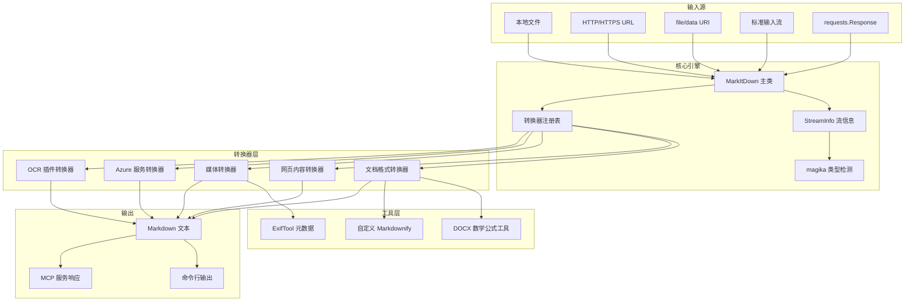
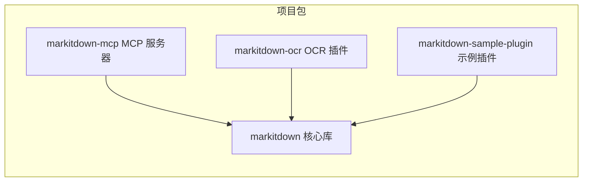
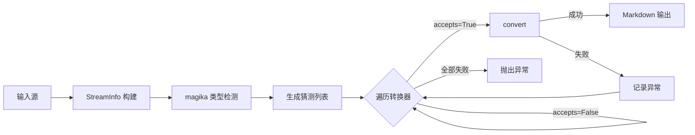
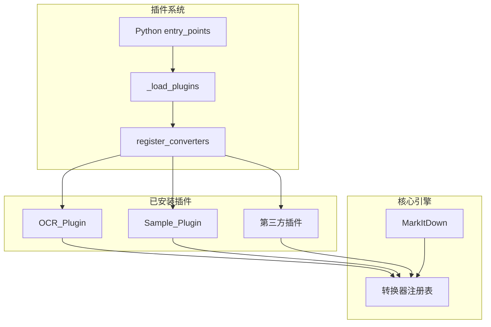

# markitdown-CN 项目总览

## 项目简介

markitdown-CN 是一个强大的多格式文档转 Markdown 工具库，由 Microsoft 开源项目 markitdown 演化而来。该项目旨在将各类常见文件格式（办公文档、网页、媒体文件、压缩包等）统一转换为结构化的 Markdown 文本，特别适合大语言模型（LLM）的文本输入场景。

项目采用 Python 语言开发，基于可插拔的转换器架构设计，内置 20+ 种格式转换器，并支持通过插件系统和 Azure 云服务进行能力扩展。

### 核心价值

- **格式覆盖广**：支持 PDF、DOCX、PPTX、XLSX、HTML、图片、音频、EPUB、CSV、ZIP 等 20+ 种格式
- **智能检测**：基于 Google magika 的文件类型自动识别，无需用户手动指定格式
- **可扩展架构**：转换器注册机制 + 插件系统（entry_points），第三方可无缝扩展
- **云服务集成**：可选对接 Azure Content Understanding 和 Document Intelligence 实现高质量转换
- **MCP 协议支持**：通过独立 MCP 服务器包，任何 MCP 客户端均可调用转换能力
- **OCR 增强**：插件化 OCR 支持，利用 LLM 视觉模型提取文档中嵌入图片的文字

---

## 端到端架构



---

## 项目包结构

项目采用 monorepo 结构，包含 4 个独立的 Python 包：



| 包名 | 说明 | 安装方式 |
|------|------|----------|
| markitdown | 核心转换库，包含所有内置转换器 | `pip install markitdown` |
| markitdown-mcp | MCP 协议服务器，支持 STDIO 和 HTTP 传输 | `pip install markitdown-mcp` |
| markitdown-ocr | OCR 增强插件，基于 LLM 视觉模型 | `pip install markitdown-ocr` |
| markitdown-sample-plugin | 示例插件，展示插件开发模式 | 开发参考 |

---

## 模块文档索引

### 核心引擎

| 模块 | 说明 | 组件数 |
|------|------|--------|
| [Core_Engine](Core_Engine.md) | 核心转换引擎，包含 MarkItDown 主类、基类、异常体系、CLI | 16 |

### 内置转换器

| 模块 | 说明 | 组件数 |
|------|------|--------|
| [Document_Format_Converters](Document_Format_Converters.md) | 办公文档格式转换（PDF/DOCX/PPTX/XLSX/CSV/EPUB 等） | 18 |
| [Web_Content_Converters](Web_Content_Converters.md) | 网页内容转换（HTML/Bing/RSS/Wikipedia/YouTube） | 5 |
| [Media_Converters](Media_Converters.md) | 多媒体转换（音频转录、图片描述、元数据提取） | 6 |

### Azure 云服务

| 模块 | 说明 | 组件数 |
|------|------|--------|
| [Azure_Service_Converters](Azure_Service_Converters.md) | Azure Content Understanding 和 Document Intelligence 集成 | 27 |

### 工具与辅助

| 模块 | 说明 | 组件数 |
|------|------|--------|
| [DOCX_Math_Utils](DOCX_Math_Utils.md) | DOCX 数学公式 OMML 到 LaTeX 转换 | 12 |

### 服务与插件

| 模块 | 说明 | 组件数 |
|------|------|--------|
| [MCP_Server](MCP_Server.md) | MCP 协议服务器，支持 STDIO/HTTP 双传输模式 | 7 |
| [OCR_Plugin](OCR_Plugin.md) | 基于 LLM 视觉模型的 OCR 增强插件 | 8 |
| [Sample_Plugin](Sample_Plugin.md) | 示例插件，展示 RTF 转换和插件开发模式 | 2 |

---

## 转换流程



核心转换流程遵循以下管线：

1. **输入解析** — 根据输入类型（路径、URL、流等）构建初始 StreamInfo
2. **类型检测** — 使用 magika 库从流内容智能推断文件类型，与 StreamInfo 交叉验证
3. **转换器匹配** — 按优先级排序遍历所有已注册转换器，调用 `accepts()` 判断兼容性
4. **执行转换** — 匹配成功后调用 `convert()` 生成 Markdown，失败则记录异常并尝试下一个
5. **结果规范化** — 去除行尾空格、合并多余空行，返回 DocumentConverterResult

---

## 插件扩展机制



插件通过 Python 标准的 `entry_points` 机制发现，每个插件只需实现 `register_converters(markitdown, **kwargs)` 函数即可向核心引擎注册自定义转换器。OCR 插件通过设置优先级 -1.0 来覆盖内置转换器，实现无缝替换。

---

## 技术栈

| 类别 | 技术 |
|------|------|
| 语言 | Python 3.10+ |
| 文件类型检测 | Google magika |
| PDF 处理 | pdfplumber / pdfminer.six |
| 办公文档 | python-docx / python-pptx / openpyxl |
| HTML 转换 | BeautifulSoup4 / markdownify |
| 语音转录 | SpeechRecognition / pydub |
| 元数据提取 | ExifTool |
| MCP 服务 | MCP Python SDK / Starlette / uvicorn |
| Azure 集成 | azure-ai-documentintelligence / azure-ai-contentunderstanding |

---

## 快速开始

### Python API

```python
from markitdown import MarkItDown

md = MarkItDown()
result = md.convert("example.pdf")
print(result.text_content)
```

### 命令行

```bash
markitdown example.pdf -o output.md
```

### MCP 服务器

```bash
# STDIO 模式（供 MCP 客户端直连）
python -m markitdown_mcp

# HTTP 模式（支持 SSE 和 Streamable HTTP）
python -m markitdown_mcp --http --port 3001
```
